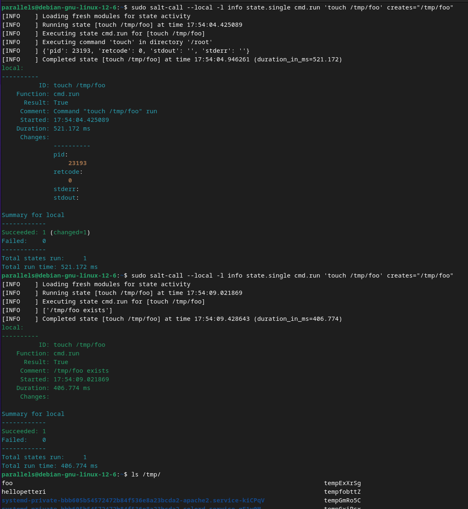

## h1 Viisikko

Tehtävät ovat Tero Karvisen opintojaksolta [Palvelinten Hallinta 2025 kevät](https://terokarvinen.com/palvelinten-hallinta/)

---

#### Laite jolla tehtävät tehdään:

- Apple MacBook Pro M2 Max
- macOS Sequoia 15.3.1
- Parallels ARM Virtual Machine
- Debian GNU/Linux 12.6

---

### x) Lue ja tiivistä

#### Tero Karvinen: [Run Salt Command Locally](https://terokarvinen.com/2021/salt-run-command-locally/)

- Salt commandin ajaminen locaalist on hyödyllinen tapa harjoitella tai testata komentoja. 
- Tärkeimmät state funktiot ovat: pkg, file, service, user ja cmd

#### Tero Karvinen: [Salt Quickstart – Salt Stack Master and Slave on Ubuntu Linux](https://terokarvinen.com/2018/03/28/salt-quickstart-salt-stack-master-and-slave-on-ubuntu-linux/)

- Salt mahdollistaa tuhansien tietokoneiden hallinnan yhdeltä koneelta. 
- Ohjattavat tietokoneet voivat olla missä vain: NAT tai palomuurin takana tai tuntemattomassa osoitteesa.
- Vain master palvelimella tarvitsee olla julkinen palvelin ja tiedossa oleva osoite.

#### Tero Karinen: [Raportin kirjoittaminen](https://terokarvinen.com/2006/06/04/raportin-kirjoittaminen-4/)

- Hyvän raportti on toteutettu niin, että:
    - sen toimenpiteet ovat toistettavia ja täsmällisiä
    - se on helppolukuinen
    - se viittaa akateemisten käytänteiden mukaisesti lähteisiin.

#### WMWare Inc: [Salt Install Guide: Linux (DEB)](https://docs.saltproject.io/salt/install-guide/en/latest/topics/install-by-operating-system/linux-deb.html)

- Uusimman version saltista voi asentaa seuraavilla komennoilla:

```
# Ensure keyrings dir exists
mkdir -p /etc/apt/keyrings
# Download public key
curl -fsSL https://packages.broadcom.com/artifactory/api/security/keypair/SaltProjectKey/public | sudo tee /etc/apt/keyrings/salt-archive-keyring.pgp
# Create apt repo target configuration
curl -fsSL https://github.com/saltstack/salt-install-guide/releases/latest/download/salt.sources | sudo tee /etc/apt/sources.list.d/salt.sources
```
```
# Metadatan päivitys
sudo apt-get update
```

- Tämän jälkeen voi asentaa haluamiaan paketteja. Esim:

```
sudo apt-get install salt-master
sudo apt-get install salt-minion
```
---

### b) Asenna Salt (salt-minion) Linuxille (uuteen virtuaalikoneeseesi).

Ajoin [Salt Install Guide: Linux (DEB)](https://docs.saltproject.io/salt/install-guide/en/latest/topics/install-by-operating-system/linux-deb.html) ohjeiden mukaisesti seuraavat komennot (asensin curl ennen kuin ajoin toisen komennon):

```
mkdir -p /etc/apt/keyrings
```

```
curl -fsSL https://packages.broadcom.com/artifactory/api/security/keypair/SaltProjectKey/public | sudo tee /etc/apt/keyrings/salt-archive-keyring.pgp
```


```
curl -fsSL https://github.com/saltstack/salt-install-guide/releases/latest/download/salt.sources | sudo tee /etc/apt/sources.list.d/salt.sources
```


```
sudo apt-get update
```

```
sudo apt-get install salt-minion
```


---

### c) Viisi tärkeintä. Näytä Linuxissa esimerkit viidestä tärkeimmästä Saltin tilafunktiosta: pkg, file, service, user, cmd. Analysoi ja selitä tulokset. 

Käytin tässä tehtävässä Karvisen sivulla olleita ohjeita ja komentoja https://terokarvinen.com/2021/salt-run-command-locally/.

#### pkg

```
sudo salt-call --local state.single pkg.installed tree
```


Tilafunktio pkg.installed mahdollistaa pakettien asentamisen. Kuten yllä olevasta kuvasta näkyy pkg funktio on (ymmärtääkseni) idempotentti (kts. tehtävä d), koska järjestelmän tila ei muutu vaikka komento ajettaisiin useita kertoja.

#### file

```
sudo salt-call --local -l info state.single file.managed /tmp/hellopetteri
```


file.managed luo tiedoston ja toimii myös idempotentisti. 

#### service

```
sudo salt-call --local -l info state.single service.running apache2 enable=True
```


Komento käynnistää servicen ja tässä tapauksessa apach2. Myös idempotentti.


#### user

```
sudo salt-call --local -l info state.single user.present petteri
```


Komento luo uuden käyttäjän. Toimii idempotentisti.

Poistin käyttjän komennolla:

```
sudo salt-call --local -l info state.single user.absent petteri
```

#### cmd

```
sudo salt-call --local -l info state.single cmd.run 'touch /tmp/foo' creates="/tmp/foo"
```



Kuten [Teron sivulla sanotaan](https://terokarvinen.com/2021/salt-run-command-locally/), cmd komento ei ole itsestään tai suoraan idempotentti, vaan siitä tulee tehdä sellainen lisäämällä komentoon cretes="". Näin komennossa toimii creates määrittelemän ehdon mukaaan. 


---

### d) Idempotentti. Anna esimerkki idempotenssista. Aja 'salt-call --local' komentoja, analysoi tulokset, selitä miten idempotenssi ilmenee.

Idempotentti on toiminto, joka varmistaa, että järjestelmä on tiedetyssä tilassa huolimatta järjestelmän tilasta ennen kuin komento suoritettiin. Tämän seurauksena komennon ajaminen useita kertoja ei aiheuta muutoksia järjestelmässä. State moduulin funktioiden tulisi olla idempotentteja. ([VMware Inc. Salt Project doc](https://docs.saltproject.io/en/3006/glossary.html)).

Havainnollistin jo edellisessä tehtävässä, miten idempotentti ilmenee ajettaessa salt-call --local komentoja. 

---

### Lähteet

Tero Karvinen. Palvelinten Hallinta: https://terokarvinen.com/palvelinten-hallinta/

Tero Karvinen. Run Salt Command Locally: https://terokarvinen.com/2021/salt-run-command-locally/

Tero Karvinen. Salt Quickstart – Salt Stack Master and Slave on Ubuntu Linux: https://terokarvinen.com/2018/03/28/salt-quickstart-salt-stack-master-and-slave-on-ubuntu-linux/

Tero Karvinen. Raportin kirjoittaminen: https://terokarvinen.com/2006/06/04/raportin-kirjoittaminen-4/

WMware Inc. Salt Project, Install guide: https://docs.saltproject.io/salt/install-guide/en/latest/topics/install-by-operating-system/linux-deb.html

WMware Inc. Salt Project, Glossary: https://docs.saltproject.io/en/3006/glossary.html 