## h1 Soitto kotiin

Tehtävät ovat Tero Karvisen opintojaksolta [Palvelinten Hallinta 2025 kevät](https://terokarvinen.com/palvelinten-hallinta/)

---

#### Laite jolla tehtävät tehdään:

- Apple MacBook Pro M2 Max
- macOS Sequoia 15.3.1
- Parallels ARM Virtual Machine
- Debian GNU/Linux 12.6

---

### x) Lue ja tiivistä

- Karvinen 2021: Two Machine Virtual Network With Debian 11 Bullseye and Vagrant [^4]

    - Vagrant automatisoi virtuaalikoneiden pystytyksen ja ssh-yhteyden 
    - Konfigurointeja voi tehdä muokkaamalla Vagrantfile

- Karvinen 2018: Salt Quickstart – Salt Stack Master and Slave on Ubuntu Linux [^7]

    - Saltilla voi ohjata tuhansia koneita ja ohjattavat koneet voivat olla NAT:n tai palomuurin takana tai tuntematomassa osoitteessa
    - Minionilla pitää olla tiedossa Masterin osoite ja masterin tulee hyväksyä minioneiden avaimet.

- Karvinen 2023: Salt Vagrant - automatically provision one master and two slaves [^6]

    - Ohjeessa tehdään tiedosto srv hakemistoon (hakemisto, jota käytetään mm. serviceiden tiedostoille [^8]), jolla voidaan ajaa infraa koodina
    - top.sls filellä saadaan määritettyä, mitkä statet ajetaan missäkin minionissa.
    
    
---

### a) Hello Vagrant! Osoita jollain komennolla, että Vagrant on asennettu

Asensin Vagratin Homebrew:llä komennoilla [^1]

```
brew tap hashicorp/tap
brew install hashicorp/tap/hashicorp-vagrant
```

```
❯ vagrant --version
Vagrant 2.4.3
```

---

### b) Linux Vagrant. Tee Vagrantilla uusi Linux-virtuaalikone

Koska halusan käyttää Vagrantia Parallelsilla, minun pitää Parallels + Vagrant dokumentaation [^2] mukaan asentaa vielä Parallels-Vagrant plugari komennolla:

```
vagrant plugin install vagrant-parallels
```

Seuraavaksi ajoin dokumentaation [^2] ohjeilla seuraavat komennot:

```
vagrant init bento/ubuntu-20.04-arm64
```

```
vagrant up --provider=parallels
```

Ilmeisesti dokumentaatioon on jäänyt joku vanha boxi.

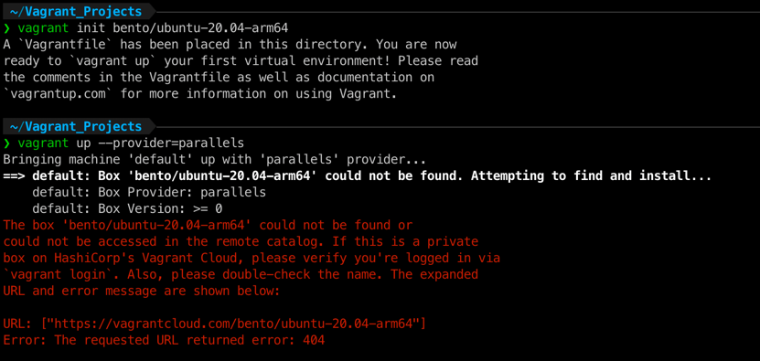

Menin Vagrantin discovery sivulle [^3] katsomaan vaihtoehtoja ja päätin valita 

```
vagrant init bento/ubuntu-24.04 --box-version 202502.21.0
```

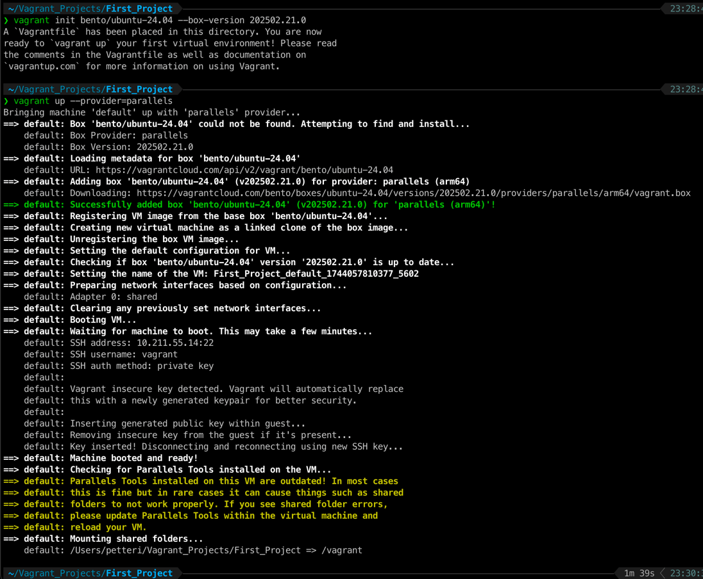

Seuraavaksi laitoin ssh komennon ja pääsin sisään. 

```
vagrant ssh
```

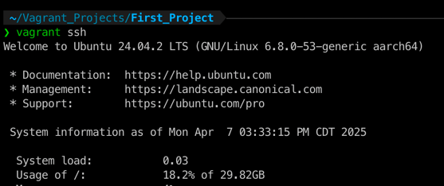

Vagrant näkyi myös Parallelsin Control Centerissä

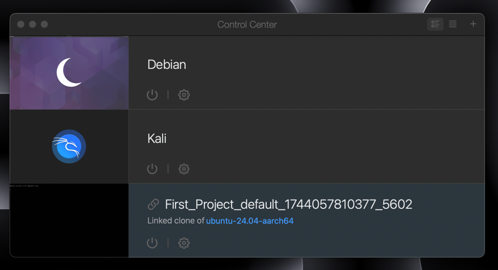

---

### c) Kaksin kaunihimpi. Tee kahden Linux-tietokoneen verkko Vagrantilla. Osoita, että koneet voivat pingata toisiaan.

Poistin äsken tehdyn koneen

```
vagrant destroy -f
```

Muokkasin Vagrantfilen seuraavalaiseksi. Käytin apuna Tero Karvisen ohjetta [^4]

```
Vagrant.configure("2") do |config|

  config.vm.box = "bento/ubuntu-24.04"
  config.vm.box_version = "202502.21.0"

  config.vm.define "master" do |master|
      master.vm.hostname = "master"
  end

  config.vm.define "minion001" do |minion001|
      minion001.vm.hostname = "minion001"
  end

end
```

Laitoin up komennon ja molemmat lähtivät päälle. Kävin ssh:lla katsomassa molempien ip-osoitteet ja koneet saivat toisiinsa yhteyden.

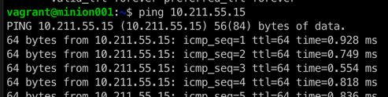

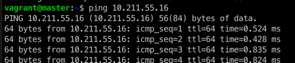

---

### d) Asenna toiselle koneelle salt-master, toiselle salt-minion.

Tein saltin asennuksen molemmille koneille kuten tein h1:ssä [^5].

Kun oli asentanut saltin (toiselle master ja toiselle minion), seurasin Karvisen ohjette [^6] ja laitoin minionille masterin osoitteen ja restarttasin salt-minion.servicen.

```
sudoedit /etc/salt/minion
```

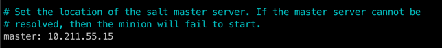

```
sudo systemctl restart salt-minion.service
```

Karvisen ohjeen mukaan [^6] hyväksyin minioiden lähettämät avaimet komennolla (salt-master.service ei ollu päällä joten käiynnistin sen ensin.)

```
sudo systemctl start salt-master.service
```

```
sudo salt-key -A
```

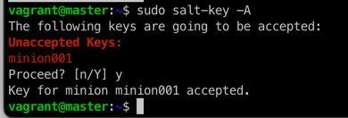

Testasin toimivuutta asentamalla masterista Apache2 minioniin Karvisen ohjeilla [^6].

```
sudo salt '*' state.single pkg.installed apache2
```

```
sudo salt '*' state.single service.running apache2
```

Testasin selaimella ja apache oli päälle.

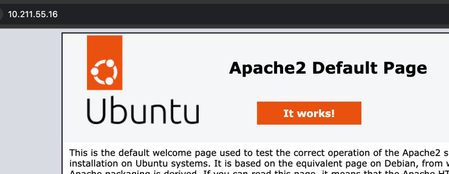

---

### e) Kokeile vähintään kahta tilaa verkon yli (viisikosta: pkg, file, service, user, cmd)

Edellisessä tehtävässä olikin jo, mutta sammutetaan apache2 [^6]

```
sudo salt '*' state.single service.dead apache2
```

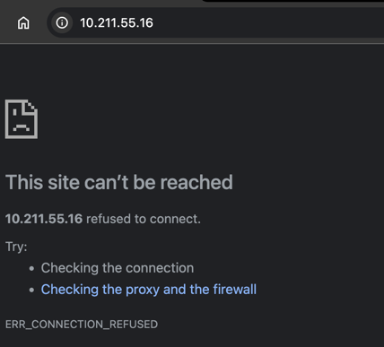

Kokeillaan vielä file [^6]

```
sudo salt '*' state.single file.managed '/home/vagrant/petteri'
```

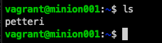


---

### Lähteet

Tero Karvinen. Palvelinten Hallinta: https://terokarvinen.com/palvelinten-hallinta/

[^1]: HashiCorp. Install Vagrant: https://developer.hashicorp.com/vagrant/install

[^2]: Parallels + Vagrans. Getting Started: https://parallels.github.io/vagrant-parallels/docs/getting-started.html

[^3]: Vagrant. Discover Vagrant Boxes: https://portal.cloud.hashicorp.com/vagrant/discover

[^4]: Tero Karvinen. Two Machine Virtual Network With Debian 11 Bullseye and Vagrant: https://terokarvinen.com/2021/two-machine-virtual-network-with-debian-11-bullseye-and-vagrant/

[^5]: pinkkila. h1-viisikko.md https://github.com/pinkkila/palvelinten-hallinta/blob/main/h1-viisikko.md

[^6]: Tero Karvinen. Salt Vagrant - automatically provision one master and two slaves: https://terokarvinen.com/2023/salt-vagrant/

[^7]: Tero Karvinen. Salt Quickstart – Salt Stack Master and Slave on Ubuntu Linux: https://terokarvinen.com/2018/salt-quickstart-salt-stack-master-and-slave-on-ubuntu-linux/?fromSearch=salt%20quickstart%20salt%20stack%20master%20and%20slave%20on%20ubuntu%20linux

[^8]: StackExchange. What does/will the directory /srv contain?: https://askubuntu.com/questions/1166555/what-does-will-the-directory-srv-contain