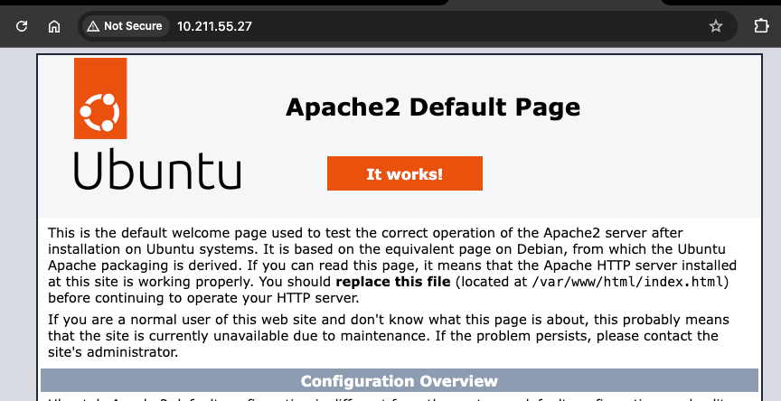
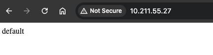

## h3 Infraa koodina

Tehtävät ovat Tero Karvisen opintojaksolta [Palvelinten Hallinta 2025 kevät](https://terokarvinen.com/palvelinten-hallinta/) [^1]

---

#### Laite jolla tehtävät tehdään:

- Apple MacBook Pro M2 Max
- macOS Sequoia 15.3.1
- Parallels Desktop

---

### x) Lue ja tiivistä

- Karvinen 2014: Hello Salt Infra-as-Code [^3]

    - Saltilla voi tehdä omia stateja. State konfiroidaan luomalla moduuli.
    - moduuli on hakemistossa /srv/salt/moduulin-nimi oleva init.sls tiedosto. 
    - moduulin koodin tulisi toteuttaa idempotentti tila.

- Salt contributors: Salt overview, kohdat [^9]

    - Salt käyttää yaml-rederoijää Salt tiedostojen kääntämiseksi pythonilla suoritettaviin komentoihin. 
    - yaml koostuu kolmesta elementistä:
      
        - Scalar (key: value)
        - List (key: jota seuraa lista
        - Dictionary (kokoelma key: valueita ja listoja)

    - yaml on organisoitu block rakenteella, joka määritetään sisennyksellä

---

### a) Hei infrakoodi! Kirjota sls-tiedosto, joka tekee esimerkkitiedoston /tmp/ -kansioon.

Tein Vagrantilla uuden virtuaalikoneen, käynnistin sen ja kirjauduin ssh:lla sisään:

```
vagrant init bento/ubuntu-24.04 --box-version 202502.21.0
```

```
vagrant up --provider=parallels
```

```
vagrant ssh
```

Asensin Saltin kuten tehtävässä h1 [^2]

```
mkdir -p /etc/apt/keyrings
curl -fsSL https://packages.broadcom.com/artifactory/api/security/keypair/SaltProjectKey/public | sudo tee /etc/apt/keyrings/salt-archive-keyring.pgp
curl -fsSL https://github.com/saltstack/salt-install-guide/releases/latest/download/salt.sources | sudo tee /etc/apt/sources.list.d/salt.sources
sudo apt-get update
sudo apt-get install salt-minion
```

Seuraavaa osaa tehdessä seurasin Karvisen ohjetta [^3].

Ensin tehdään `salt` ja `hello` hakemistot hakemistoon srv (srv-hakemistoa käytetään mm. serviceiden tiedostoille [^4])

- -p - parametri p luo parent hakemiston, jos sellaista ei ole [^5] (ennen komentoa srv hakemisto oli tyhjä)

```
sudo mkdir -p /srv/salt/hello/
```

srv/salt hakemisto tulee jaetuksi kaikille minion tietokoneille. [^3] 

tässä /hello hakemisto on mooduuli, joka tulee sisältämään kaiken moduuliin tarvittan (voi sisältää koodia, tiedostoja tai templateja) [^3]

Kun moduuli "hello" ajetaan, entrypointtina on /hello hakemistoon tehtävä tiedosto init.sls [^3]

Tein seuraavaksi juurikin tuon init.sls tiedoston ja seuraavalla komennolla ja sisällöllä [^3]:

```
sudoedit init.sls
```

```yaml
/tmp/hellopetteri  # tässä on virhe
  file.managed
```

Tämän jälkeen ajoin seuraavan komennon [^3]:

```
sudo salt-call --local state.apply hello
```

Jokin meni pieleen:

```bash
vagrant@vagrant:/srv/salt/hello$ cat init.sls
/tmp/hellopetteri
  file.managed
vagrant@vagrant:/srv/salt/hello$ cd
vagrant@vagrant:~$ sudo salt-call --local state.apply hello
local:
    Data failed to compile:
----------
    SLS hello does not render to a dictionary
----------
    Error when rendering state with contents: /tmp/hellopetteri file.managed
vagrant@vagrant:~$
```

Tarkistin onko salt-minion.service päällä ja käynnistin sen uudelleen. Virhe ei poistunut. 

```bash
vagrant@vagrant:~$ sudo systemctl status salt-minion.service
● salt-minion.service - The Salt Minion
     Loaded: loaded (/usr/lib/systemd/system/salt-minion.service; enabled; preset: enabled)
     Active: active (running) since Mon 2025-04-14 07:47:16 CDT; 32min ago
       Docs: man:salt-minion(1)
             file:///usr/share/doc/salt/html/contents.html
             https://docs.saltproject.io/en/latest/contents.html
   Main PID: 2300 (python3.10)
      Tasks: 3 (limit: 4549)
     Memory: 58.9M (peak: 62.7M)
        CPU: 548ms
     CGroup: /system.slice/salt-minion.service
             ├─2300 /opt/saltstack/salt/bin/python3.10 /usr/bin/salt-minion
             └─2309 "/opt/saltstack/salt/bin/python3.10 /usr/bin/salt-minion MultiMinionProcessManager MinionProcessManager"

Apr 14 08:17:48 vagrant salt-minion[2309]: [ERROR   ] DNS lookup or connection check of 'salt' failed.
Apr 14 08:17:48 vagrant salt-minion[2309]: [ERROR   ] Master hostname: 'salt' not found or not responsive. Retrying in 30 seconds
Apr 14 08:18:18 vagrant salt-minion[2309]: [ERROR   ] DNS lookup or connection check of 'salt' failed.
Apr 14 08:18:18 vagrant salt-minion[2309]: [ERROR   ] Master hostname: 'salt' not found or not responsive. Retrying in 30 seconds
Apr 14 08:18:48 vagrant salt-minion[2309]: [ERROR   ] DNS lookup or connection check of 'salt' failed.
Apr 14 08:18:48 vagrant salt-minion[2309]: [ERROR   ] Master hostname: 'salt' not found or not responsive. Retrying in 30 seconds
Apr 14 08:19:18 vagrant salt-minion[2309]: [ERROR   ] DNS lookup or connection check of 'salt' failed.
Apr 14 08:19:18 vagrant salt-minion[2309]: [ERROR   ] Master hostname: 'salt' not found or not responsive. Retrying in 30 seconds
Apr 14 08:19:48 vagrant salt-minion[2309]: [ERROR   ] DNS lookup or connection check of 'salt' failed.
Apr 14 08:19:48 vagrant salt-minion[2309]: [ERROR   ] Master hostname: 'salt' not found or not responsive. Retrying in 30 seconds
vagrant@vagrant:~$ sudo systemctl restart salt-minion.service
vagrant@vagrant:~$ sudo salt-call --local state.apply hello
local:
    Data failed to compile:
----------
    SLS hello does not render to a dictionary
----------
    Error when rendering state with contents: /tmp/hellopetteri file.managed
vagrant@vagrant:~$
```

Testasin lokaalisti salt pkg komentoa ja se toimi. 

```bash
vagrant@vagrant:~$ sudo salt-call --local state.single pkg.installed tree
local:
----------
          ID: tree
    Function: pkg.installed
      Result: True
     Comment: The following packages were installed/updated: tree
     Started: 08:23:55.629230
    Duration: 3353.711 ms
     Changes:
              ----------
              tree:
                  ----------
                  new:
                      2.1.1-2ubuntu3
                  old:

Summary for local
------------
Succeeded: 1 (changed=1)
Failed:    0
------------
Total states run:     1
Total run time:   3.354 s
vagrant@vagrant:~$
```

Googlailin ja tämän keskustelun perusteella mietin, että vika on varmaan init.sls tiedoston syntaxissa [^6].

Tiedostosta puuttuu kaksoispiste. Korjauksen jälkeen:

```bash
vagrant@vagrant:/srv/salt/hello$ cat init.sls
/tmp/hellopetteri:
  file.managed
```

Nyt komento toimi odotetusti ja varmistin myös idempotenttisyyden:

```bash
vagrant@vagrant:/srv/salt/hello$ sudo salt-call --local state.apply hello
[WARNING ] State for file: /tmp/hellopetteri - Neither 'source' nor 'contents' nor 'contents_pillar' nor 'contents_grains' was defined, yet 'replace' was set to 'True'. As there is no source to replace the file with, 'replace' has been set to 'False' to avoid reading the file unnecessarily.
local:
----------
          ID: /tmp/hellopetteri
    Function: file.managed
      Result: True
     Comment: Empty file
     Started: 08:40:31.075416
    Duration: 2.214 ms
     Changes:
              ----------
              new:
                  file /tmp/hellopetteri created

Summary for local
------------
Succeeded: 1 (changed=1)
Failed:    0
------------
Total states run:     1
Total run time:   2.214 ms
vagrant@vagrant:/srv/salt/hello$ sudo salt-call --local state.apply hello
[WARNING ] State for file: /tmp/hellopetteri - Neither 'source' nor 'contents' nor 'contents_pillar' nor 'contents_grains' was defined, yet 'replace' was set to 'True'. As there is no source to replace the file with, 'replace' has been set to 'False' to avoid reading the file unnecessarily.
local:
----------
          ID: /tmp/hellopetteri
    Function: file.managed
      Result: True
     Comment: File /tmp/hellopetteri exists with proper permissions. No changes made.
     Started: 08:40:35.194126
    Duration: 2.019 ms
     Changes:

Summary for local
------------
Succeeded: 1
Failed:    0
------------
Total states run:     1
Total run time:   2.019 ms
```

```bash
vagrant@vagrant:~$ ls /tmp
hellopetteri
```

---

### b) Aja esimerkki sls-tiedostosi verkon yli orjalla.

Minioneita ohjataan masterin /srv/salt/ hakemistoon konfiguroitujen moduulien avulla. [^1].

Tein ensin kaksi virtuaalikonetta ja niihin master minion konfiguroinnin, kuten olin tehnyt tehtävässä h2 [^7].  

Koska olin poistanut aiemman virtuaalikoneen ja tehnyt uudet, tein uuden modluulin:

```bash
vagrant@master:~$ cat /srv/salt/hello/init.sls
/tmp/hellominion:
  file.managed
```

Katsoin Karvisen sivun ohjeesta, miten moduulin (tai oikeammin varmaan ehkä state-komennon) voi ajaa [^1].

```
sudo salt '*' state.apply hello
```

```bash
vagrant@master:~$ sudo salt '*' state.apply hello
minion001:
----------
          ID: /tmp/hellominion
    Function: file.managed
      Result: True
     Comment: Empty file
     Started: 09:34:37.415465
    Duration: 2.688 ms
     Changes:
              ----------
              new:
                  file /tmp/hellominion created

Summary for minion001
------------
Succeeded: 1 (changed=1)
Failed:    0
------------
Total states run:     1
Total run time:   2.688 ms
vagrant@master:~$ sudo salt '*' state.apply hello
minion001:
----------
          ID: /tmp/hellominion
    Function: file.managed
      Result: True
     Comment: File /tmp/hellominion exists with proper permissions. No changes made.
     Started: 09:35:23.207695
    Duration: 2.496 ms
     Changes:

Summary for minion001
------------
Succeeded: 1
Failed:    0
------------
Total states run:     1
Total run time:   2.496 ms
vagrant@master:~$
```

```bash
vagrant@minion001:~$ ls /tmp
hellominion
```

---

### c) Tee sls-tiedosto, joka käyttää vähintään kahta eri tilafunktiota näistä: package, file, service, user.

Karvisen ohjeen [^3] loppuosion ohjeen perusteella lähdin kokeilemaan seuraavaa (eli koitan asentaa apache2 omalla statella):

```bash
vagrant@master:/srv/salt$ sudo mkdir web
vagrant@master:/srv/salt$ ls
hello  web
vagrant@master:/srv/salt$ cd web
vagrant@master:/srv/salt/web$ ls
vagrant@master:/srv/salt/web$ sudoedit init.sls
vagrant@master:/srv/salt/web$ cat init.sls
apache2:
  pkg.installed
vagrant@master:/srv/salt/web$
```

```bash
vagrant@master:/srv/salt/web$ sudo salt '*' state.apply web
minion001:
----------
          ID: apache2
    Function: pkg.installed
      Result: True
     Comment: The following packages were installed/updated: apache2
     Started: 10:19:16.901774
    Duration: 5726.295 ms
     Changes:
              ----------
              apache2:
                  ----------
                  new:
                      2.4.58-1ubuntu8.6
                  old:
              apache2-bin:
                  ----------
                  new:
                      2.4.58-1ubuntu8.6
                  old:
              apache2-data:
                  ----------
                  new:
                      2.4.58-1ubuntu8.6
                  old:
              apache2-utils:
                  ----------
                  new:
                      2.4.58-1ubuntu8.6
                  old:
              libapr1t64:
                  ----------
                  new:
                      1.7.2-3.1ubuntu0.1
                  old:
              libaprutil1-dbd-sqlite3:
                  ----------
                  new:
                      1.6.3-1.1ubuntu7
                  old:
              libaprutil1-ldap:
                  ----------
                  new:
                      1.6.3-1.1ubuntu7
                  old:
              libaprutil1t64:
                  ----------
                  new:
                      1.6.3-1.1ubuntu7
                  old:
              liblua5.4-0:
                  ----------
                  new:
                      5.4.6-3build2
                  old:
              ssl-cert:
                  ----------
                  new:
                      1.1.2ubuntu1
                  old:

Summary for minion001
------------
Succeeded: 1 (changed=1)
Failed:    0
------------
Total states run:     1
Total run time:   5.726 s
vagrant@master:/srv/salt/web$ sudo salt '*' state.apply web
minion001:
----------
          ID: apache2
    Function: pkg.installed
      Result: True
     Comment: All specified packages are already installed
     Started: 10:20:35.507272
    Duration: 10.465 ms
     Changes:

Summary for minion001
------------
Succeeded: 1
Failed:    0
------------
Total states run:     1
Total run time:  10.465 ms
vagrant@master:/srv/salt/web$
```

Komento näyttäisi toimineen ja toimivan myös idempotentisti. Katsotaan selaimesta minionin ip-osoitteella onko apache2 päällä ja näyttäisi olevan.



Meitin, että voisin kokoilla vaihtaa tuon default sivun ja tarkastelin Karvisen ohjetta mukaillen eri ohjeita [^1]

```
sudo salt-call --local sys.state_doc cmd
```

ja huomasin cmd ohjeissa seuraavan esimerkin:

```bash
        '> /var/log/messages/':
          cmd.run:
          - unless: echo 'foo' > /tmp/.test && rm -f /tmp/.test
```

En tiedä onko järkevää muuttaa cmd.run statella default sivua (ei varmaan), mutta kokeillaan. Muokkasin /srv/salt/web/init.sls useampaankin kertaan (jätän laittamatta, koska en koe, että niillä periaatteessa arvauksilla olisi kauhen paljon arvo) ja katsottuani myös Salt Projectin dokumentaatiota [^8], päädyin seuraavaan:

```yaml
apache2:
  pkg.installed: []

'echo default | sudo tee /var/www/html/index.html':
  cmd.run:
    - unless: grep "default" /var/www/html/index.html
```

```bash
vagrant@master:/srv/salt/web$ sudo salt '*' state.apply web
minion001:
----------
          ID: apache2
    Function: pkg.installed
      Result: True
     Comment: All specified packages are already installed
     Started: 12:21:55.003415
    Duration: 10.512 ms
     Changes:
----------
          ID: echo default | sudo tee /var/www/html/index.html
    Function: cmd.run
      Result: True
     Comment: Command "echo default | sudo tee /var/www/html/index.html" run
     Started: 12:21:55.014153
    Duration: 152.736 ms
     Changes:
              ----------
              pid:
                  5414
              retcode:
                  0
              stderr:
              stdout:
                  default

Summary for minion001
------------
Succeeded: 2 (changed=1)
Failed:    0
------------
Total states run:     2
Total run time: 163.248 ms
vagrant@master:/srv/salt/web$ sudo salt '*' state.apply web
minion001:
----------
          ID: apache2
    Function: pkg.installed
      Result: True
     Comment: All specified packages are already installed
     Started: 12:12:49.922558
    Duration: 11.14 ms
     Changes:
----------
          ID: echo default | sudo tee /var/www/html/index.html
    Function: cmd.run
      Result: True
     Comment: unless condition is true
     Started: 12:12:49.933959
    Duration: 155.766 ms
     Changes:

Summary for minion001
------------
Succeeded: 2
Failed:    0
------------
Total states run:     2
Total run time: 166.906 ms
```

Sivu on myös vaihtunut: 




Seuraavaksi ajattelin tehdä tilan joka varmistaa, että apache on enabled, siltä varalta, jos minionin kone sammuu, eikä apache2 oliskaan enabled. 

Katsoin seuraavalla komennolla ohjeita:

```
sudo salt-call --local sys.state_doc service
```

Vaikutti siltä, että tämä onnistuu vain lisäämällä muutaman rivin, jolloin init.sls näytti tältä:

```yaml
apache2:
  pkg.installed: []
  service.running:
    - enable: True

'echo default | sudo tee /var/www/html/index.html':
  cmd.run:
    - unless: grep "default" /var/www/html/index.html
```

```bash
vagrant@master:/srv/salt/web$ sudo salt '*' state.apply web
minion001:
----------
          ID: apache2
    Function: pkg.installed
      Result: True
     Comment: All specified packages are already installed
     Started: 13:45:53.477479
    Duration: 10.71 ms
     Changes:
----------
          ID: apache2
    Function: service.running
      Result: True
     Comment: The service apache2 is already running
     Started: 13:45:53.488419
    Duration: 8.969 ms
     Changes:
----------
          ID: echo defaulttttt | sudo tee /var/www/html/index.html
    Function: cmd.run
      Result: True
     Comment: unless condition is true
     Started: 13:45:53.497624
    Duration: 150.235 ms
     Changes:

Summary for minion001
------------
Succeeded: 3
Failed:    0
------------
Total states run:     3
Total run time: 169.914 ms
```

Vaikuttaa toimivan, mutta kävin vielä varmistukseski muuttamassa minionin apachen disablediksi.

```bash
vagrant@minion001:~$ sudo systemctl disable apache2
Synchronizing state of apache2.service with SysV service script with /usr/lib/systemd/systemd-sysv-install.
Executing: /usr/lib/systemd/systemd-sysv-install disable apache2
Removed "/etc/systemd/system/multi-user.target.wants/apache2.service".
vagrant@minion001:~$ sudo systemctl status apache2
● apache2.service - The Apache HTTP Server
     Loaded: loaded (/usr/lib/systemd/system/apache2.service; disabled; preset: enabled)
     Active: active (running) since Mon 2025-04-14 10:19:20 CDT; 3h 29min ago
       Docs: https://httpd.apache.org/docs/2.4/
   Main PID: 4211 (apache2)
      Tasks: 55 (limit: 4549)
     Memory: 5.8M (peak: 6.2M)
        CPU: 1.201s
     CGroup: /system.slice/apache2.service
             ├─4211 /usr/sbin/apache2 -k start
             ├─4213 /usr/sbin/apache2 -k start
             └─4214 /usr/sbin/apache2 -k start

Apr 14 10:19:20 minion001 systemd[1]: Starting apache2.service - The Apache HTTP Server...
Apr 14 10:19:20 minion001 apachectl[4210]: AH00558: apache2: Could not reliably determine the server's fully qualified domain >
Apr 14 10:19:20 minion001 systemd[1]: Started apache2.service - The Apache HTTP Server.
```

Seuraavaksi ajoin web staten. 

```bash
vagrant@master:/srv/salt/web$ sudo salt '*' state.apply web
minion001:
----------
          ID: apache2
    Function: pkg.installed
      Result: True
     Comment: All specified packages are already installed
     Started: 13:49:45.205188
    Duration: 10.674 ms
     Changes:
----------
          ID: apache2
    Function: service.running
      Result: True
     Comment: Service apache2 has been enabled, and is in the desired state
     Started: 13:49:45.216122
    Duration: 366.487 ms
     Changes:
              ----------
              apache2:
                  True
----------
          ID: echo defaulttttt | sudo tee /var/www/html/index.html
    Function: cmd.run
      Result: True
     Comment: unless condition is true
     Started: 13:49:45.583004
    Duration: 154.275 ms
     Changes:

Summary for minion001
------------
Succeeded: 3 (changed=1)
Failed:    0
------------
Total states run:     3
Total run time: 531.436 ms
```

Ja tupavarmistukseksi minion apachen oli enabled.

```bash
vagrant@minion001:~$ sudo systemctl status apache2
● apache2.service - The Apache HTTP Server
     Loaded: loaded (/usr/lib/systemd/system/apache2.service; enabled; preset: enabled)
     Active: active (running) since Mon 2025-04-14 10:19:20 CDT; 3h 31min ago
       Docs: https://httpd.apache.org/docs/2.4/
   Main PID: 4211 (apache2)
      Tasks: 55 (limit: 4549)
     Memory: 5.8M (peak: 6.2M)
        CPU: 1.214s
     CGroup: /system.slice/apache2.service
             ├─4211 /usr/sbin/apache2 -k start
             ├─4213 /usr/sbin/apache2 -k start
             └─4214 /usr/sbin/apache2 -k start

Apr 14 10:19:20 minion001 systemd[1]: Starting apache2.service - The Apache HTTP Server...
Apr 14 10:19:20 minion001 apachectl[4210]: AH00558: apache2: Could not reliably determine the server's fully qualified domain >
Apr 14 10:19:20 minion001 systemd[1]: Started apache2.service - The Apache HTTP Server.
```


---

### Lähteet

[^1]: Tero Karvinen. Palvelinten Hallinta: https://terokarvinen.com/palvelinten-hallinta/ 

[^2]: pinkkila. h1 Viisikko: https://github.com/pinkkila/palvelinten-hallinta/blob/main/h1-viisikko.md 

[^3]: Tero Karvinen. Hello Salt Infra-as-Code: https://terokarvinen.com/2024/hello-salt-infra-as-code/ 

[^4]: StackExchange. What does/will the directory /srv contain?: https://askubuntu.com/questions/1166555/what-does-will-the-directory-srv-contain 

[^5]: man mkdir

[^6]: Stack Overflow: Failed to compile SLS file: https://stackoverflow.com/questions/28273621/failed-to-compile-sls-file

[^7]: pinkkila. h2-soitto-kotiin. https://github.com/pinkkila/palvelinten-hallinta/blob/main/h2-soitto_kotiin.md

[^8]: Salt Project. How Do I Use Salt States?: https://docs.saltproject.io/en/3006/topics/tutorials/starting_states.html

[^9]: Salt Project. Salt overview: https://docs.saltproject.io/salt/user-guide/en/latest/topics/overview.html#rules-of-yaml