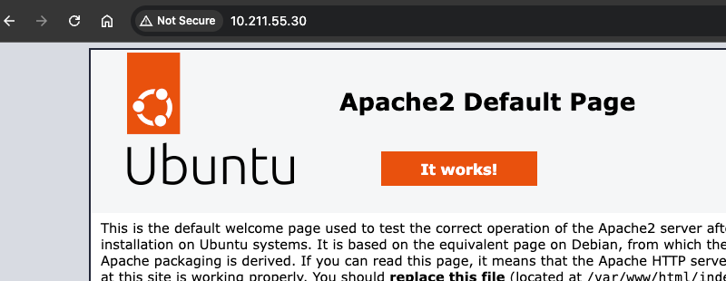
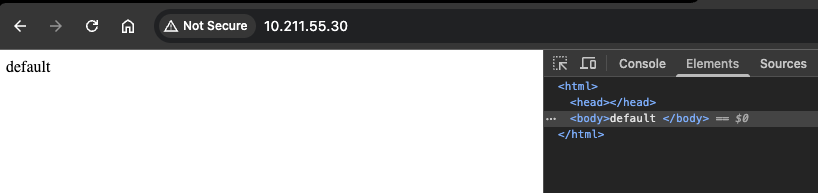
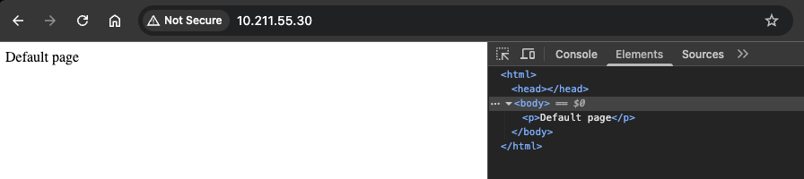
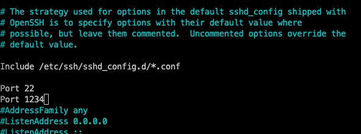

## h4 Pkg-file-service

Tehtävät ovat Tero Karvisen opintojaksolta [Palvelinten Hallinta 2025 kevät](https://terokarvinen.com/palvelinten-hallinta/) [^1]

---

#### Laite jolla tehtävät tehdään:

- Apple MacBook Pro M2 Max
- macOS Sequoia 15.3.1
- Parallels Desktop

---

### x) Lue ja tiivistä

- Karvinen 2018: Pkg-File-Service – Control Daemons with Salt – Change SSH Server Port [^4]

    - Package - File - Service on yleinen patterni deamoneiden hallintaa 
    - Aukikirjoitettuna pattern on: asenna ohjelma, korvaa konfigurointitiedosto ja käynnistä deamon, jolloin uusi konfigurointi tulee käyttöön.
    - On suositeltavaa asentaa jokainen moduuli omaan kansioonsa hakemiston /srv/salt/ (esim /srv/salt/ssh/init.ssl) [^1].

---

### a) Apache easy mode. Asenna Apache, korvaa sen testisivu ja varmista, että demoni käynnistyy.

Asensin Vagrantilla kaksi virtuaalikonetta master ja minion, sekä niihin salt [^2] (hyppää seuraavaan otsikkoon):

```
vagrant init bento/ubuntu-24.04 --box-version 202502.21.0
```

```
Vagrant.configure("2") do |config|

  config.vm.box = "bento/ubuntu-24.04"
  config.vm.box_version = "202502.21.0"

  config.vm.define "master" do |master|
      master.vm.hostname = "master"
  end

  config.vm.define "minion001" do |minion001|
      minion001.vm.hostname = "minion001"
  end

end
```

```
vagrant up --provider=parallels
```

```
vagrant ssh [vm name]
```

```
mkdir -p /etc/apt/keyrings
curl -fsSL https://packages.broadcom.com/artifactory/api/security/keypair/SaltProjectKey/public | sudo tee /etc/apt/keyrings/salt-archive-keyring.pgp
curl -fsSL https://github.com/saltstack/salt-install-guide/releases/latest/download/salt.sources | sudo tee /etc/apt/sources.list.d/salt.sources
sudo apt-get update
```

```
sudo apt-get install salt-minion
```

```
sudo apt-get install salt-master
```

```
sudoedit /etc/salt/minion
```

```
sudo systemctl restart salt-minion.service
```

```
sudo systemctl start salt-master.service
```

```
sudo salt-key -A
```

###### Ensin käsin, vasta sitten automaattisesti.

Käytin masterissa seuraavia komentoja [^2]:

```
sudo salt '*' state.single pkg.installed apache2
```

```
sudo salt '*' state.single service.running apache2
```

Tarkistin selaimella, että apache2 pyörii minionilla:



Seuraavaksi default sivu piti vaihtaa ja olin tehnyt aiemmin tehtävässä h3 omalla statella [^3], joten muokkailin aiemmin tekemääni: 

```
sudo salt '*' state.single cmd.run 'echo default | tee /var/www/html/index.html' unless='grep "default" /var/www/html/index.html' 
```

```bash
vagrant@master:~$ sudo salt '*' state.single cmd.run 'echo default | tee /var/www/html/index.html' unless='grep "default" /var/www/html/index.html'
minion001:
----------
          ID: echo default | tee /var/www/html/index.html
    Function: cmd.run
      Result: True
     Comment: unless condition is true
     Started: 10:48:33.536313
    Duration: 417.104 ms
     Changes:

Summary for minion001
------------
Succeeded: 1
Failed:    0
------------
Total states run:     1
Total run time: 417.104 ms
```

Unless condition on true, koska default sana löytyy apache2:n default sivulta. Luin myös Teron ohjetta [^1] tässä välissä, kun mietin onko tuo cmd.run tässä hyvä, niin huomasin myös, että tee ei ole sudo:na, mutta ehkä sen ei tässä tarvitsekkaan olla. 

Lisäsin grep komentoon -x, jolloin vastaavuuden pitää olla koko line [^3].

```
sudo salt '*' state.single cmd.run 'echo default | tee /var/www/html/index.html' unless='grep -x "default" /var/www/html/index.html' 
```

Tämä toimi ja sudoa ei tarvinnut lisätä. Muistelisin tunnilta niin, että salt komennot ajetaan sudo:na, niin Teron ohje [^1] tarkoitti varmaaninkin muuta tilannetta kuin tätä. Testatin myös, että komento toimii idempotentisti ajamalla sen kahdesti.



```bash 
vagrant@master:~$ sudo salt '*' state.single cmd.run 'echo default | tee /var/www/html/index.html' unless='grep -x "default" /var/www/html/index.html'
minion001:
----------
          ID: echo default | tee /var/www/html/index.html
    Function: cmd.run
      Result: True
     Comment: Command "echo default | tee /var/www/html/index.html" run
     Started: 11:09:26.160834
    Duration: 416.603 ms
     Changes:
              ----------
              pid:
                  4257
              retcode:
                  0
              stderr:
              stdout:
                  default

Summary for minion001
------------
Succeeded: 1 (changed=1)
Failed:    0
------------
Total states run:     1
Total run time: 416.603 ms
vagrant@master:~$ sudo salt '*' state.single cmd.run 'echo default | tee /var/www/html/index.html' unless='grep -x "default" /var/www/html/index.html'
minion001:
----------
          ID: echo default | tee /var/www/html/index.html
    Function: cmd.run
      Result: True
     Comment: unless condition is true
     Started: 11:11:32.108912
    Duration: 412.258 ms
     Changes:

Summary for minion001
------------
Succeeded: 1
Failed:    0
------------
Total states run:     1
Total run time: 412.258 ms
```

###### Kirjoita tila sls-tiedostoon.

```bash
$ cat /srv/salt/sshd.sls
openssh-server:
pkg.installed
/etc/ssh/sshd_config:
file.managed:
- source: salt://sshd_config
  sshd:
  service.running:
- watch:
    - file: /etc/ssh/sshd_config
```

Tein Karvisen ohjetta [^4] apuna käyttäen apache nimisen kansion hakemistoon /srv/salt/ ja sinne init.sls tiedoston:

```
sudo mkdir -p /srv/salt/apache
```

```
sudoedit /srv/salt/apache/init.sls
```

Käytin apuna Karivsen ohjetta [^5] ja muutin init.sls tiedoston seuraavaksi: 

```yaml
apache2:
  pkg.installed
/var/www/html/index.html:
  file.managed:
    - source: salt://apache/default-index.html
```

Tässä ajattelin, että tuo aiempi käsin tehtävä versio olisi varmastikkin ollut parempi myös tehdä tuolla file.managed statella. 

Seuraavaksi tein srv/salt/apache hakemistoon default-index.html nimisen tiedoston ja siihen seuraavan html:

```html
<p>Default page</p>
```

Seuraavaksi ajoin komennon ja toimi odotetulla tavalla (sivu päivittyi ja modulin toimi idempotentisti):

```
sudo salt '*' state.apply apache
```

```bash
vagrant@master:~$ sudo salt '*' state.apply apache
minion001:
----------
          ID: apache2
    Function: pkg.installed
      Result: True
     Comment: All specified packages are already installed
     Started: 12:31:31.715931
    Duration: 11.038 ms
     Changes:
----------
          ID: /var/www/html/index.html
    Function: file.managed
      Result: True
     Comment: File /var/www/html/index.html updated
     Started: 12:31:31.727525
    Duration: 7.467 ms
     Changes:
              ----------
              diff:
                  ---
                  +++
                  @@ -1 +1 @@
                  -default
                  +<p>Default page</p>

Summary for minion001
------------
Succeeded: 2 (changed=1)
Failed:    0
------------
Total states run:     2
Total run time:  18.505 ms
vagrant@master:~$ sudo salt '*' state.apply apache
minion001:
----------
          ID: apache2
    Function: pkg.installed
      Result: True
     Comment: All specified packages are already installed
     Started: 12:31:41.134367
    Duration: 10.85 ms
     Changes:
----------
          ID: /var/www/html/index.html
    Function: file.managed
      Result: True
     Comment: File /var/www/html/index.html is in the correct state
     Started: 12:31:41.145738
    Duration: 4.643 ms
     Changes:

Summary for minion001
------------
Succeeded: 2
Failed:    0
------------
Total states run:     2
Total run time:  15.493 ms
vagrant@master:~$
```



---

### b) SSHouto. Lisää uusi portti, jossa SSHd kuuntelee.

###### Ensin käsin.

Jotta voisin nyt käyttää file.managed tarvitsisin ensin tiedoston, jolla suorittaisin varsinaisen komennon. Päätin jo valmiiksi tehdä /srv/sal hakemistoon tarvittavan kansion ja tiedoston. 

```
sudo mkdir -p /srv/salt/ssh
```

Kopioin (ei mennyt ilman sudo:a) /etc/ssh/sshd_config tiedoston hakemistoon /srv/salt/ssh:

```
sudo cp /etc/ssh/sshd_config /srv/salt/ssh
```

Karvisen ohjeilla [^1] lisäsin Port 22 alle toisen Port rivin ja laitoin vinkeissä olleen portin 1234.



Seuraavaksi tutkin, miten saisin file.managed tilalla valittua input tiedoston ja oletettavasti se onnistuu `source` parametrilla. [^7]

```
sudo salt-call --local sys.state_doc file | less
```

```
sudo salt '*' state.single pkg.installed openssh-server
```

```
sudo salt '*' state.single file.managed /etc/ssh/sshd_config source="/srv/salt/ssh/sshd_config" # ei toimi
```

```bash
vagrant@master:~$ sudo salt '*' state.single pkg.installed openssh-server
minion001:
----------
          ID: openssh-server
    Function: pkg.installed
      Result: True
     Comment: All specified packages are already installed
     Started: 03:16:48.962047
    Duration: 12.803 ms
     Changes:

Summary for minion001
------------
Succeeded: 1
Failed:    0
------------
Total states run:     1
Total run time:  12.803 ms
```

Seuraava komento ei toiminut

```bash
vagrant@master:~$ sudo salt '*' state.single file.managed /etc/ssh/sshd_config source="/srv/salt/ssh/sshd_config"
minion001:
----------
          ID: /etc/ssh/sshd_config
    Function: file.managed
      Result: False
     Comment: Local file source /srv/salt/ssh/sshd_config does not exist
     Started: 03:20:15.660975
    Duration: 2.628 ms
     Changes:

Summary for minion001
------------
Succeeded: 0
Failed:    1
------------
Total states run:     1
Total run time:   2.628 ms
ERROR: Minions returned with non-zero exit code
vagrant@master:~$ cat /srv/salt/ssh/sshd_config

# This is the sshd server system-wide configuration file.  See
# sshd_config(5) for more information.
```

Katsoin `sys.state_doc file` ja: 

```
            source
                The source file to download to the minion, this source file can be
                hosted on either the salt master server (``salt://``), the salt minion
                local file system (``/``), or on an HTTP or FTP server (``http(s)://``,
                ``ftp://``).
```

Jolloin komennon pitäisikin ehkä olla:

```
sudo salt '*' state.single file.managed /etc/ssh/sshd_config source="salt://srv/salt/ssh/sshd_config"
```

Ei toiminut:

```bash
vagrant@master:~$ sudo salt '*' state.single file.managed /etc/ssh/sshd_config source="salt://srv/salt/ssh/sshd_config"
minion001:
----------
          ID: /etc/ssh/sshd_config
    Function: file.managed
      Result: False
     Comment: Source file salt://srv/salt/ssh/sshd_config not found in saltenv 'base'
     Started: 03:28:00.058874
    Duration: 4.77 ms
     Changes:

Summary for minion001
------------
Succeeded: 0
Failed:    1
------------
Total states run:     1
Total run time:   4.770 ms
ERROR: Minions returned with non-zero exit code
vagrant@master:~$
```

Mutta koska "not found in saltenv 'base'", niin voisi olettaa, että tässä voi varmaankin käyttää samalla tavalla sourcea kuin .sls tiedostoissa ja kokeilin seuraavaksi kuten Karvisen ohjeen [^4] .sls tiedostossa ja se toimi: 

```
sudo salt '*' state.single file.managed /etc/ssh/sshd_config source="salt://ssh/sshd_config"
```

```bash
vagrant@master:~$ sudo salt '*' state.single file.managed /etc/ssh/sshd_config source="salt://ssh/sshd_config"
minion001:
----------
          ID: /etc/ssh/sshd_config
    Function: file.managed
      Result: True
     Comment: File /etc/ssh/sshd_config updated
     Started: 03:32:35.672613
    Duration: 11.228 ms
     Changes:
              ----------
              diff:
                  ---
                  +++
                  @@ -11,7 +11,8 @@

                   Include /etc/ssh/sshd_config.d/*.conf

                  -#Port 22
                  +Port 22
                  +Port 1234
                   #AddressFamily any
                   #ListenAddress 0.0.0.0
                   #ListenAddress ::

Summary for minion001
------------
Succeeded: 1 (changed=1)
Failed:    0
------------
Total states run:     1
Total run time:  11.228 ms
vagrant@master:~$ sudo salt '*' state.single file.managed /etc/ssh/sshd_config source="salt://ssh/sshd_config"
minion001:
----------
          ID: /etc/ssh/sshd_config
    Function: file.managed
      Result: True
     Comment: File /etc/ssh/sshd_config is in the correct state
     Started: 03:32:45.299788
    Duration: 7.349 ms
     Changes:

Summary for minion001
------------
Succeeded: 1
Failed:    0
------------
Total states run:     1
Total run time:   7.349 ms
```

Kokeilin yhteyttä Karvisen ohjeella [^4] ja yhteyttä ei ollut johtuen varmastikin siitä, että ssh deamon pitäisi varmasti käynnistää uudelleen.

```
nc -vz 10.211.55.30 1234
```

```bash
 ~/Vagrant_Projects/H4_Project ──────────────────────────────────────────────────────────────────────────────────────────────────────── 53m 36s  11:48:09
❯ nc -vz 10.211.55.30 1234
nc: connectx to 10.211.55.30 port 1234 (tcp) failed: Connection refused
```

- nc - nc (netcat) on utility komento tcp ja upd yhteyksien kokeilemiseen [^6]
- -v - verbose [^6]
- -z - skannaus vain kuuntelevista demoneista ilman, että niihin lähetetään dataa. [^6] 

```
sudo salt-call --local sys.state_doc service | less
```

En löytänyt ainakaan nopeast selattuani, miten saisin uudelleen käynnistettyä ssh-deamonin (ja miten se olisi statena idempotentti? Ei varmaan mitenkään), niin päätin kokeilla service.running:ia soveltaen init.sls tiedostoa Karvisen ohjeessa [^4].

```
sudo salt '*' state.single service.running watch="file:/etc/ssh/sshd_config" # väärin, tarvitaan name
```

```bash
vagrant@master:~$ sudo salt '*' state.single service.running watch="file:/etc/ssh/sshd_config"
minion001:
    Passed invalid arguments to state.single: single() missing 1 required positional argument: 'name'

        Execute a single state function with the named kwargs, returns False if
        insufficient data is sent to the command

        By default, the values of the kwargs will be parsed as YAML. So, you can
        specify lists values, or lists of single entry key-value maps, as you
        would in a YAML salt file. Alternatively, JSON format of keyword values
        is also supported.

        CLI Example:

        .. code-block:: bash

            salt '*' state.single pkg.installed name=vim


ERROR: Minions returned with non-zero exit code
```

```
sudo salt '*' state.single service.running name="sshd" watch="file:/etc/ssh/sshd_config"
```

```bash
vagrant@master:~$ sudo salt '*' state.single service.running name="sshd" watch="file:/etc/ssh/sshd_config"
minion001:
----------
          ID: sshd
    Function: service.running
      Result: False
     Comment: The named service sshd is not available
     Started: 04:08:57.542078
    Duration: 5.097 ms
     Changes:

Summary for minion001
------------
Succeeded: 0
Failed:    1
------------
Total states run:     1
Total run time:   5.097 ms
ERROR: Minions returned with non-zero exit code
vagrant@master:~$ sudo salt '*' state.single service.running name="ssh" watch="file:/etc/ssh/sshd_config"
minion001:
----------
          ID: ssh
    Function: service.running
      Result: True
     Comment: The service ssh is already running
     Started: 04:09:08.532610
    Duration: 13.728 ms
     Changes:

Summary for minion001
------------
Succeeded: 1
Failed:    0
------------
Total states run:     1
Total run time:  13.728 ms
vagrant@master:~$ sudo salt '*' state.single file.managed /etc/ssh/sshd_config source="salt://ssh/sshd_config"
minion001:
----------
          ID: /etc/ssh/sshd_config
    Function: file.managed
      Result: True
     Comment: File /etc/ssh/sshd_config is in the correct state
     Started: 04:09:51.017903
    Duration: 7.406 ms
     Changes:

Summary for minion001
------------
Succeeded: 1
Failed:    0
------------
Total states run:     1
Total run time:   7.406 ms
```

Nyt se sshd_config ei ole muuttunut, joten laitan siihen yhden rivin lisää, niin katsotaan mitä tapahtuu. 

```bash
vagrant@master:/srv/salt/ssh$ sudo salt '*' state.single file.managed /etc/ssh/sshd_config source="salt://ssh/sshd_config"
minion001:
----------
          ID: /etc/ssh/sshd_config
    Function: file.managed
      Result: True
     Comment: File /etc/ssh/sshd_config updated
     Started: 04:12:32.256938
    Duration: 11.203 ms
     Changes:
              ----------
              diff:
                  ---
                  +++
                  @@ -12,6 +12,8 @@
                   Include /etc/ssh/sshd_config.d/*.conf

                   Port 22
                  +
                  +
                   Port 1234
                   #AddressFamily any
                   #ListenAddress 0.0.0.0

Summary for minion001
------------
Succeeded: 1 (changed=1)
Failed:    0
------------
Total states run:     1
Total run time:  11.203 ms
vagrant@master:/srv/salt/ssh$ sudo salt '*' state.single service.running name="ssh" watch="file:/etc/ssh/sshd_config"
minion001:
----------
          ID: ssh
    Function: service.running
      Result: True
     Comment: The service ssh is already running
     Started: 04:13:03.940657
    Duration: 10.831 ms
     Changes:

Summary for minion001
------------
Succeeded: 1
Failed:    0
------------
Total states run:     1
Total run time:  10.831 ms
vagrant@master:/srv/salt/ssh$ exit
logout
```

Ei toiminut. 

```bash
 ~/Vagrant_Projects/H4_Project ──────────────────────────────────────────────────────────────────────────────────────────────────────── 13m 58s  12:13:34
❯ nc -vz 10.211.55.30 1234
nc: connectx to 10.211.55.30 port 1234 (tcp) failed: Connection refused
```

Menen tekemään restartin minioniin käsin ja katson mitä tapahtuu

Jostain syystä ainoastaan reboot käynnistää ssh:n niin, että sshd_config tulee luetuksi. Mikään seuraavista komennoista ei saanut sshd_configissa tehtyjä muutoksia aktivoitumaan:

```
sudo systemclt restart ssh
sudo systemctl restart sshd
sudo systemctl restart ssh.service
sudo systemctl restart sshd.service
```

journalctl näytti tältä `sudo systemctl restart sshd` jälkeen (tällä hetkellä sshd_config:ssa on Port 8888):

```bash
Apr 21 16:08:07 minion001 sshd[1705]: Received signal 15; terminating.
Apr 21 16:08:07 minion001 systemd[1]: Stopping ssh.service - OpenBSD Secure Shell server...
Apr 21 16:08:07 minion001 systemd[1]: ssh.service: Deactivated successfully.
Apr 21 16:08:07 minion001 systemd[1]: Stopped ssh.service - OpenBSD Secure Shell server.
Apr 21 16:08:07 minion001 systemd[1]: Starting ssh.service - OpenBSD Secure Shell server...
Apr 21 16:08:07 minion001 sshd[1741]: Server listening on :: port 1234.
Apr 21 16:08:07 minion001 sshd[1741]: Server listening on :: port 22.
Apr 21 16:08:07 minion001 systemd[1]: Started ssh.service - OpenBSD Secure Shell server.
```

Ubuntun dokumentaation mukaan `sudo systemctl restart ssh.service` pitäisi kännistää sshd-serveri [^9]

Vaihdon vagrant boxia ja otin tällä kertaa bento/debian-12 [^8] ja asensin siihen salt master/minion konfiguraation.

```
vagrant init bento/debian-12 --box-version 202502.21.0
```

```bash
Vagrant.configure("2") do |config|

  config.vm.box = "bento/debian-12"
  config.vm.box_version = "202502.21.0"

  config.vm.define "master" do |master|
      master.vm.hostname = "master"
  end

  config.vm.define "minion001" do |minion001|
      minion001.vm.hostname = "minion001"
  end

end
```


```bash
vagrant@minion001:~$ cat /etc/os-release
PRETTY_NAME="Debian GNU/Linux 12 (bookworm)"
NAME="Debian GNU/Linux"
VERSION_ID="12"
VERSION="12 (bookworm)"
VERSION_CODENAME=bookworm
ID=debian
HOME_URL="https://www.debian.org/"
SUPPORT_URL="https://www.debian.org/support"
BUG_REPORT_URL="https://bugs.debian.org/"
```

Jatketaan siitä mihin jäätiin eli komennot jotka ajettu:

```
sudo salt '*' state.single pkg.installed openssh-server
```

```
sudo salt '*' state.single file.managed /etc/ssh/sshd_config source="salt://srv/salt/ssh/sshd_config"
```

Ja kun kävin käsin kokeilemassa `sudo systemctl restart sshd`, niin ssh-deamon/serveri käynnistyy ja uusi sshd_config file tulee luetuksi. 

Nyt pitäisi siis saada tehtyä komento, jonka state uudelleen käynnistää ssh:n kun /etc/ssh/sshd_config file muuttuu. Kokeillaan seuraavaa:

```
sudo salt '*' state.single service.running name="sshd" watch="file:/etc/ssh/sshd_config"
```

```bash
vagrant@master:~$ sudo salt '*' state.single service.running name="sshd" watch="file:/etc/ssh/sshd_config"
minion001:
----------
          ID: sshd
    Function: service.running
      Result: True
     Comment: The service sshd is already running
     Started: 11:10:23.106016
    Duration: 17.637 ms
     Changes:

Summary for minion001
------------
Succeeded: 1
Failed:    0
------------
Total states run:     1
Total run time:  17.637 ms
```

Ja sitten muutetaan masterissa `/srv/salt/ssh/sshd_config` ja ajetaan komento:

```
sudo salt '*' state.single file.managed /etc/ssh/sshd_config source="salt://ssh/sshd_config"
```

```bash
vagrant@master:~$ sudo salt '*' state.single file.managed /etc/ssh/sshd_config source="salt://ssh/sshd_config"
minion001:
----------
          ID: /etc/ssh/sshd_config
    Function: file.managed
      Result: True
     Comment: File /etc/ssh/sshd_config updated
     Started: 11:14:25.082401
    Duration: 11.301 ms
     Changes:
              ----------
              diff:
                  ---
                  +++
                  @@ -12,7 +12,7 @@
                   Include /etc/ssh/sshd_config.d/*.conf

                   Port 22
                  -Port 1235
                  +Port 1234
                   #AddressFamily any
                   #ListenAddress 0.0.0.0
                   #ListenAddress ::

Summary for minion001
------------
Succeeded: 1 (changed=1)
Failed:    0
------------
Total states run:     1
Total run time:  11.301 ms
```

Nyt ssh-deamonin olisi ymmärtääkseni pitänyt käynnistyä uudelleen, jos watch aiemmassa komennossa toimii. Kokeillaan komennolla:

```
nc -vz 10.211.55.30 1234
```

Ei toiminut (mahtaakohan watch toimia ylipäätään ollenkaan state.single:llä 🤔). Päätin käynnistää minionin sshd-serverin saltilla käyttäen jotain muuta komentoa.

```
sudo salt '*' state.single service.running name=sshd #ei käynnistynyt uudelleen
```

Seuraava toimii, mutta ei mielestäni ole idempotentti, eikä muutenkaan tunnu minusta mitenkään miltään state:lta, koska tämähän aina vain käynnistää uudelleen. 

```
sudo salt '*' state.single cmd.run 'systemctl restart sshd"
```

```bash
vagrant@master:~$ sudo salt '*' state.single cmd.run 'systemctl restart sshd'
minion001:
----------
          ID: systemctl restart sshd
    Function: cmd.run
      Result: True
     Comment: Command "systemctl restart sshd" run
     Started: 11:33:42.772087
    Duration: 36.554 ms
     Changes:
              ----------
              pid:
                  2631
              retcode:
                  0
              stderr:
              stdout:

Summary for minion001
------------
Succeeded: 1 (changed=1)
Failed:    0
------------
Total states run:     1
Total run time:  36.554 ms
vagrant@master:~$ nc -vz 10.211.55.32 1234
first-debian-minion001-1745241774567-88943.shared [10.211.55.32] 1234 (?) open
```


###### Kirjoita tila sls-tiedostoon.

Tein jo valmiiseen /srv/salt/ssh hakemistoon init.sls tiedoston. Käytin apuna Karvisen ohjetta [^4]:

```
sudoedit /srv/salt/ssh/init.sls
```

```yaml
openssh-server:
  pkg.installed
/etc/ssh/sshd_config:
  file.managed:
    - source: salt://ssh/sshd_config
sshd:
  service.running:
    - watch:
      - file: /etc/ssh/sshd_config
```

Muutin `/srv/salt/ssh/sshd_config` tiedostosta portiksi 1235.

```
sudo salt '*' state.apply ssh
```

```bash
vagrant@master:~$ sudo salt '*' state.apply ssh
minion001:
----------
          ID: openssh-server
    Function: pkg.installed
      Result: True
     Comment: All specified packages are already installed
     Started: 11:46:51.131978
    Duration: 8.794 ms
     Changes:
----------
          ID: /etc/ssh/sshd_config
    Function: file.managed
      Result: True
     Comment: File /etc/ssh/sshd_config updated
     Started: 11:46:51.141288
    Duration: 7.902 ms
     Changes:
              ----------
              diff:
                  ---
                  +++
                  @@ -12,7 +12,7 @@
                   Include /etc/ssh/sshd_config.d/*.conf

                   Port 22
                  -Port 1234
                  +Port 1235
                   #AddressFamily any
                   #ListenAddress 0.0.0.0
                   #ListenAddress ::
----------
          ID: sshd
    Function: service.running
      Result: True
     Comment: Service restarted
     Started: 11:46:51.167132
    Duration: 31.827 ms
     Changes:
              ----------
              sshd:
                  True

Summary for minion001
------------
Succeeded: 3 (changed=2)
Failed:    0
------------
Total states run:     3
Total run time:  48.523 ms
vagrant@master:~$ nc -vz 10.211.55.32 1234
first-debian-minion001-1745241774567-88943.shared [10.211.55.32] 1234 (?) : Connection refused
vagrant@master:~$ nc -vz 10.211.55.32 1235
first-debian-minion001-1745241774567-88943.shared [10.211.55.32] 1235 (?) open
vagrant@master:~$ sudo salt '*' state.apply ssh
minion001:
----------
          ID: openssh-server
    Function: pkg.installed
      Result: True
     Comment: All specified packages are already installed
     Started: 11:49:28.335166
    Duration: 8.361 ms
     Changes:
----------
          ID: /etc/ssh/sshd_config
    Function: file.managed
      Result: True
     Comment: File /etc/ssh/sshd_config is in the correct state
     Started: 11:49:28.344025
    Duration: 4.337 ms
     Changes:
----------
          ID: sshd
    Function: service.running
      Result: True
     Comment: The service sshd is already running
     Started: 11:49:28.348684
    Duration: 16.633 ms
     Changes:

Summary for minion001
------------
Succeeded: 3
Failed:    0
------------
Total states run:     3
Total run time:  29.331 ms
```

Portti oli vaihtunut ja moduuli toimi idempotentisti. 

---

### Asenna ja konfiguroi Apache ja Name Based Virtual Host. Sen tulee näyttää palvelimen etusivulla weppisivua. Weppisivun tulee olla muokattavissa käyttäjän oikeuksin, ilman sudoa.

Tehdään ensin apache niminen moduuli ja siihen tarvittavat tiedostot:

```
sudo mkdir -p /srv/salt/apache/
```

```bash
vagrant@master:/srv/salt/apache$ sudoedit pinkkila.com.conf
vagrant@master:/srv/salt/apache$ cat pinkkila.com.conf
<VirtualHost *:80>
 ServerName pinkkila.com
 ServerAlias www.pinkkila.com
 DocumentRoot /home/vagrant/public_sites/pinkkila.com
 <Directory /home/vagrant/public_sites/pinkkila.com>
   Require all granted
 </Directory>
</VirtualHost>
```

```bash
vagrant@master:/srv/salt/apache$ cat index.html
<h1>Pinkkila</h1>
```

```
sudoedit /srv/salt/apache/init.sls
```

Käytin tässä apuna Karvisen ohjetta [^5] ja `apache_site` ja `require` otin Linoden ohjeesta [^9].

`apache_site` on saltin apache moduulista. disabled = a2dissite ja enabled = a2ensite [^9].

Vaikka totetus tekeekin, mitä sen pitäisi, eroaa se paljon molemmista lähteistä ja on sitä myöten varmaankin toteutuksena "ei paras mahdollinen".

(Alunperin vagrant käyttäjän kotihakemistolla ei ollut x oikeuksia ja muutin ne minionista käsin `sudo chmod ugo+x`).

```yaml
apache2:
  pkg.installed

/var/www/html/index.html:
  file.managed:
    - source: salt://apache/default-index.html

/etc/apache2/sites-available/pinkkila.com.conf:
  file.managed:
    - source: salt://apache/pinkkila.com.conf

/home/vagrant/public_sites/pinkkila.com/index.html:
  file.managed:
    - source: salt://apache/index.html
    - makedirs: true

000-default.conf:
  apache_site.disabled

pinkkila.com:
  apache_site.enabled

apache2_service:
  service.running:
    - name: apache2
    - watch:
      - file: /etc/apache2/sites-available/pinkkila.com.conf
      - apache_site: pinkkila.com
    - require:
      - apache_site: pinkkila.com
```

```bash
vagrant@master:~$ sudo salt '*' state.apply apache
minion001:
----------
          ID: apache2
    Function: pkg.installed
      Result: True
     Comment: The following packages were installed/updated: apache2
     Started: 16:39:53.590492
    Duration: 2937.963 ms
     Changes:
              ----------
              apache2:
                  ----------
                  new:
                      2.4.62-1~deb12u2
                  old:
----------
          ID: /var/www/html/index.html
    Function: file.managed
      Result: True
     Comment: File /var/www/html/index.html updated
     Started: 16:39:56.529286
    Duration: 6.827 ms
     Changes:
              ----------
              diff:
                  ---
                  +++
                  @@ -1,368 +1 @@
                  
                  
                  +default
----------
          ID: /etc/apache2/sites-available/pinkkila.com.conf
    Function: file.managed
      Result: True
     Comment: File /etc/apache2/sites-available/pinkkila.com.conf updated
     Started: 16:39:56.536147
    Duration: 3.695 ms
     Changes:
              ----------
              diff:
                  New file
              mode:
                  0644
----------
          ID: /home/vagrant/public_sites/pinkkila.com/index.html
    Function: file.managed
      Result: True
     Comment: File /home/vagrant/public_sites/pinkkila.com/index.html updated
     Started: 16:39:56.539883
    Duration: 3.403 ms
     Changes:
              ----------
              diff:
                  New file
              mode:
                  0644
----------
          ID: 000-default.conf
    Function: apache_site.disabled
      Result: True
     Comment:
     Started: 16:39:56.543954
    Duration: 11.976 ms
     Changes:
              ----------
              new:
                  None
              old:
                  000-default.conf
----------
          ID: pinkkila.com
    Function: apache_site.enabled
      Result: True
     Comment:
     Started: 16:39:56.555972
    Duration: 11.056 ms
     Changes:
              ----------
              new:
                  pinkkila.com
              old:
                  None
----------
          ID: apache2_service
    Function: service.running
        Name: apache2
      Result: True
     Comment: Service restarted
     Started: 16:39:56.579550
    Duration: 252.679 ms
     Changes:
              ----------
              apache2:
                  True

Summary for minion001
------------
Succeeded: 7 (changed=7)
Failed:    0
------------
Total states run:     7
Total run time:   3.228 s
```


---

### Lähteet

[^1]: Tero Karvinen. Palvelinten Hallinta: https://terokarvinen.com/palvelinten-hallinta/ 

[^2]: pinkkila. h2 Soitto kotiin: https://github.com/pinkkila/palvelinten-hallinta/blob/main/h2-soitto_kotiin.md

[^3]: man grep

[^4]: Tero Karvinen. Pkg-File-Service – Control Daemons with Salt – Change SSH Server Port: https://terokarvinen.com/2018/04/03/pkg-file-service-control-daemons-with-salt-change-ssh-server-port/?fromSearch=karvinen%20salt%20ssh

[^5]: Tero Karvinen. Apache User Homepages Automatically – Salt Package-File-Service Example: https://terokarvinen.com/2018/04/03/apache-user-homepages-automatically-salt-package-file-service-example/ 

[^6]: man nc

[^7]: salt sys.state_doc file

[^8]: HashiCorp. Portal Cloud: https://portal.cloud.hashicorp.com/vagrant/discover/bento/debian-12

[^9]: Ubuntu Server. OpenSSH server: https://documentation.ubuntu.com/server/how-to/security/openssh-server/index.html

[^10]: Linode LLC. Configure Apache with Salt Stack: https://www.linode.com/docs/guides/configure-apache-with-salt-stack/