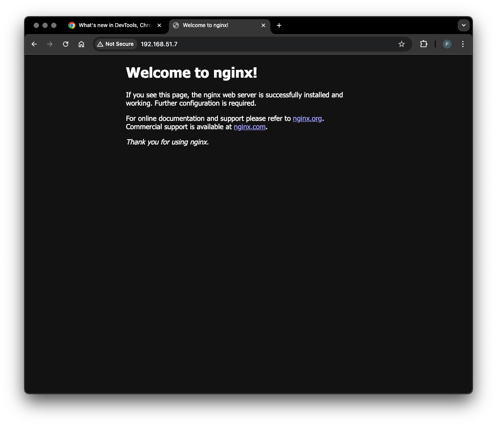
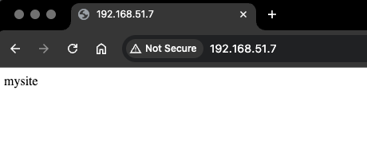
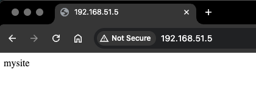
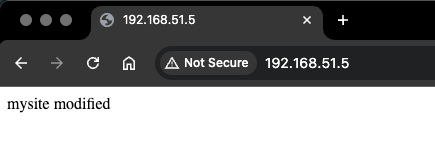

## h6 Bonus

Tehtävät ovat Tero Karvisen opintojaksolta [Palvelinten Hallinta 2025 kevät](https://terokarvinen.com/palvelinten-hallinta/) [^1]

---

#### Laite jolla tehtävät tehdään:

- Apple MacBook Pro M2 Max
- macOS Sequoia 15.3.1
- Parallels Desktop

---

## Vapaaehtoinen bonus: luettele ja linkitä tähän tekemäsi vapaaehtoiset tehtävät

h4:sta minulla oli jäänyt tekemättä d, e ja f. Tein tehtäviä varten seuraavan Vagrantfilen:

```bash
$minion = <<MINION
sudo apt-get update
mkdir -p /etc/apt/keyrings
cp /vagrant_data/SaltProjectKey.gpg.pub /etc/apt/keyrings/salt-archive-keyring.pgp
cp /vagrant_data/salt.sources /etc/apt/sources.list.d/salt.sources
sudo apt-get update
sudo apt-get -qy install salt-minion
echo "master: 192.168.51.4">/etc/salt/minion
sudo systemctl restart salt-minion.service
MINION

$master = <<MASTER
sudo apt-get update
mkdir -p /etc/apt/keyrings
cp /vagrant_data/SaltProjectKey.gpg.pub /etc/apt/keyrings/salt-archive-keyring.pgp
cp /vagrant_data/salt.sources /etc/apt/sources.list.d/salt.sources
sudo apt-get update
sudo apt-get -qy install salt-master
sudo systemctl start salt-master.service
MASTER

Vagrant.configure("2") do |config|

  config.vm.box = "bento/debian-12"
  config.vm.box_version = "202502.21.0"

  config.vm.define "master" do |master|
      master.vm.hostname = "master"
      master.vm.network "private_network", ip: "192.168.51.4"
      master.vm.synced_folder ".", "/vagrant_data"
      master.vm.provision :shell, inline: $master
  end

  config.vm.define "minion001" do |minion001|
      minion001.vm.hostname = "minion001"
      minion001.vm.network "private_network", ip: "192.168.51.5"
      minion001.vm.synced_folder ".", "/vagrant_data"
      minion001.vm.provision :shell, inline: $minion
  end

  config.vm.define "minion002" do |minion002|
      minion002.vm.hostname = "minion002"
      minion002.vm.network "private_network", ip: "192.168.51.6"
      minion002.vm.synced_folder ".", "/vagrant_data"
      minion002.vm.provision :shell, inline: $minion
  end

  config.vm.define "minion003" do |minion003|
      minion003.vm.hostname = "minion003"
      minion003.vm.network "private_network", ip: "192.168.51.7"
      minion003.vm.synced_folder ".", "/vagrant_data"
      minion003.vm.provision :shell, inline: $minion
  end

end
```


### h4: c) Vapaaehtoinen, haastavahko tässä vaiheessa: Asenna ja konfiguroi Apache ja Name Based Virtual Host. Sen tulee näyttää palvelimen etusivulla weppisivua. Weppisivun tulee olla muokattavissa käyttäjän oikeuksin, ilman sudoa.

https://github.com/pinkkila/palvelinten-hallinta/blob/main/h4-pkg-file-service.md#c-asenna-ja-konfiguroi-apache-ja-name-based-virtual-host-sen-tulee-näyttää-palvelimen-etusivulla-weppisivua-weppisivun-tulee-olla-muokattavissa-käyttäjän-oikeuksin-ilman-sudoa

---

### h4: d) Vapaaehtoinen, haastava: Caddy. Asenna Caddy tarjoilemaan weppisivua. Weppisivun tulee näkyä palvelimen etusivulla (localhost). HTML:n tulee olla jonkun käyttäjän kotihakemistossa, ja olla muokattavissa normaalin käyttäjän oikeuksin, ilman sudoa.

Aika loppui kesken, mutta täytyy tutkia tätä kurssin jälkeen. Vaikutti erittäin hyvältä ja jännä nähdä millainen on käyttää. 


---

### h4: e) Vapaaehtoinen, haastava: Nginx. Asenna Nginx (lausutaan engine-X) tarjoilemaan weppisivua. Weppisivun tulee näkyä palvelimen etusivulla (localhost). HTML:n tulee olla jonkun käyttäjän kotihakemistossa, ja olla muokattavissa normaalin käyttäjän oikeuksin, ilman sudoa.

Asennan koko homman ensin minion003:ssa kokonaan käsin.

Aloitin `sudo apt-get install nginx` ja default etusivu tuli näkyviin: 



Lueskelin nginx:n dokumentaatiota [^6] ja tarkistin missä .conf tiedostot ovat ja näyttivät olevan `/etc/nginx` hakemistossa. 

```bash
vagrant@minion003:/etc/nginx$ ls
conf.d        fastcgi_params  koi-win     modules-available  nginx.conf    scgi_params      sites-enabled  uwsgi_params
fastcgi.conf  koi-utf         mime.types  modules-enabled    proxy_params  sites-available  snippets       win-utf
```

Näyttää olevan niin, että molemmissa `sites-enabled` ja `sites-available` tiedostoissa on defaulttina sama sisältö. Avaan itselleni tiedostoissa neuvotun wikin:

https://wiki.debian.org/Nginx/DirectoryStructure [^6].

Debianin wikin mukaan [^6] ./nginx.conf on a primary configuration file ja ./sites-available on extra virtual host configuration files.
./sites-enabled on sitten taas Symlink sites-available/<file> to enable vhost.

Defaul sivun html on `/var/www/html/index.nginx-debian.html`.

./sites-available ja ./sites-enabled default tiedostosta löytyy seuraava ohje:

```bash
# Virtual Host configuration for example.com
#
# You can move that to a different file under sites-available/ and symlink that
# to sites-enabled/ to enable it.
#
#server {
#	listen 80;
#	listen [::]:80;
#
#	server_name example.com;
#
#	root /var/www/example.com;
#	index index.html;
#
#	location / {
#		try_files $uri $uri/ =404;
#	}
#}
```

Kokeillaan mitä tapahtuu kun teen ./sites-available tiedoston mysite ja laitan sen sisällöksi:

```text
server {
        listen 80;
        listen [::]:80;

        server_name mysite.com;

        root $HOME/mysite/mysite.com;
        index index.html;

        location / {
                try_files $uri $uri/ =404;
        }
}
```

Ja sitten

```bash
vagrant@minion003:~/mysite/mysite.com$ nano index.html #sisällöksi mysite
```

Katsoin miten tehdään symlink [^8].

```bash
vagrant@minion003:/etc/nginx/sites-available$ ln -s /etc/nginx/sites-available/mysite /etc/nginx/sites-enabled/
ln: failed to create symbolic link '/etc/nginx/sites-enabled/mysite': Permission denied
vagrant@minion003:/etc/nginx/sites-available$ sudo ln -s /etc/nginx/sites-available/mysite /etc/nginx/sites-enabled/
vagrant@minion003:/etc/nginx/sites-available$ cd /etc/nginx/sites-enabled/
vagrant@minion003:/etc/nginx/sites-enabled$ ls
default  mysite
```

```bash
vagrant@minion003:/etc/nginx/sites-enabled$ sudo systemctl restart nginx
Job for nginx.service failed because the control process exited with error code.
See "systemctl status nginx.service" and "journalctl -xeu nginx.service" for details.
vagrant@minion003:/etc/nginx/sites-enabled$ sudo systemctl status nginx
× nginx.service - A high performance web server and a reverse proxy server
     Loaded: loaded (/lib/systemd/system/nginx.service; enabled; preset: enabled)
     Active: failed (Result: exit-code) since Mon 2025-05-12 04:45:40 CDT; 15s ago
   Duration: 36min 43.664s
       Docs: man:nginx(8)
    Process: 1611 ExecStartPre=/usr/sbin/nginx -t -q -g daemon on; master_process on; (code=exited, status=1/FAILURE)
        CPU: 5ms

May 12 04:45:40 minion003 systemd[1]: Starting nginx.service - A high performance web server and a reverse proxy server...
May 12 04:45:40 minion003 nginx[1611]: 2025/05/12 04:45:40 [emerg] 1611#1611: unknown "home" variable
May 12 04:45:40 minion003 nginx[1611]: nginx: configuration file /etc/nginx/nginx.conf test failed
May 12 04:45:40 minion003 systemd[1]: nginx.service: Control process exited, code=exited, status=1/FAILURE
May 12 04:45:40 minion003 systemd[1]: nginx.service: Failed with result 'exit-code'.
May 12 04:45:40 minion003 systemd[1]: Failed to start nginx.service - A high performance web server and a reverse proxy server.
```

muutin ($HOME toimii varmaan vain skripteissä, mikä käy järkeen) 

```text
server {
	listen 80;
	listen [::]:80;

	server_name mysite.com;

	root home/vagrant/mysite/mysite.com;
	index index.html;

	location / {
		try_files $uri $uri/ =404;
	}
}
```

nginx pyörii mutta sivu on edelleen default. Pitääköhän se symlink poistaa siitä defaultista?

```bash
vagrant@minion003:/etc/nginx/sites-available$ cd /etc/nginx/sites-enabled/
vagrant@minion003:/etc/nginx/sites-enabled$ ls
default  mysite
vagrant@minion003:/etc/nginx/sites-enabled$ rm default
rm: cannot remove 'default': Permission denied
vagrant@minion003:/etc/nginx/sites-enabled$ sudo rm default
vagrant@minion003:/etc/nginx/sites-enabled$ sudo systemctl restart nginx
```

Nyt nginx:n default sivu ei enää näy selaimessa ja tilalla on 404 Not Found sivu. 

Huomasin, että mysite nginx konfigurointi filestä puuttuu "/" root pathista. Lisäsin myös pathin perään /. Nyt näyttää tältä:

```text
server {
        listen 80;
        listen [::]:80;

        server_name mysite.com;

        root /home/vagrant/mysite/mysite.com/;
        index index.html;

        location / {
                try_files $uri $uri/ =404;
        }
}
```

Edelleen 404. `sudo journalctl -u nginx -f` ei näyttänyt kuin käynnistyksen mutta `sudo tail -f /var/log/nginx/error.log` :

```bash
vagrant@minion003:~/mysite/mysite.com$ sudo tail -f /var/log/nginx/error.log
2025/05/12 06:05:25 [crit] 1926#1926: *4 stat() "/home/vagrant/mysite/mysite.com/favicon.ico" failed (13: Permission denied), client: 192.168.51.1, server: mysite.com, request: "GET /favicon.ico HTTP/1.1", host: "192.168.51.7", referrer: "http://192.168.51.7/"
2025/05/12 06:05:25 [crit] 1926#1926: *4 stat() "/home/vagrant/mysite/mysite.com/favicon.ico" failed (13: Permission denied), client: 192.168.51.1, server: mysite.com, request: "GET /favicon.ico HTTP/1.1", host: "192.168.51.7", referrer: "http://192.168.51.7/"
2025/05/12 06:05:29 [crit] 1926#1926: *4 stat() "/home/vagrant/mysite/mysite.com/" failed (13: Permission denied), client: 192.168.51.1, server: mysite.com, request: "GET / HTTP/1.1", host: "192.168.51.7"
2025/05/12 06:05:29 [crit] 1926#1926: *4 stat() "/home/vagrant/mysite/mysite.com/" failed (13: Permission denied), client: 192.168.51.1, server: mysite.com, request: "GET / HTTP/1.1", host: "192.168.51.7"
```

Tältä näytti ja tein seuraavaa: 

```bash
vagrant@minion003:~$ namei -l ~/mysite/mysite.com/index.html
f: /home/vagrant/mysite/mysite.com/index.html
drwxr-xr-x root    root    /
drwxr-xr-x root    root    home
drwx------ vagrant vagrant vagrant
drwxr-xr-x vagrant vagrant mysite
drwxr-xr-x vagrant vagrant mysite.com
-rw-r--r-- vagrant vagrant index.html
vagrant@minion003:~$ sudo chmod ugo+x .
vagrant@minion003:~$ namei -l ~/mysite/mysite.com/index.html
f: /home/vagrant/mysite/mysite.com/index.html
drwxr-xr-x root    root    /
drwxr-xr-x root    root    home
drwx--x--x vagrant vagrant vagrant
drwxr-xr-x vagrant vagrant mysite
drwxr-xr-x vagrant vagrant mysite.com
-rw-r--r-- vagrant vagrant index.html
```

Nyt oikea sivu näkyi selaimessa.




Seuraavaksi sama, mutta salt moduulilla. Tein `/srv/salt/web` hakemistoon init.sls filen ja files kansion, johon kopioin äsken käsin tehdyt sisällöt:

file.absent [^9]

```yaml
nginx:
  pkg.installed

/var/www/html/index.nginx-debian.html:
  file.managed:
    - source: salt://web/files/default-index.html

/home/vagrant/mysite/mysite.com/index.html:
  file.managed:
    - source: salt://web/files/index.html
    - makedirs: true

/etc/nginx/sites-available/mysite:
  file.managed:
    - source: salt://web/files/mysite
    - require:
        - pkg: nginx

make-symlink:
  cmd.run:
    - name: ln -s /etc/nginx/sites-available/mysite /etc/nginx/sites-enabled/
    - creates: /etc/nginx/sites-enabled/mysite
    - require:
        - file: /etc/nginx/sites-available/mysite

/etc/nginx/sites-enabled/default:
  file.absent

nginx.service:
  service.running:
    - watch:
        - file: /home/vagrant/mysite/mysite.com/index.html
    - require:
        - pkg: nginx
```

Toimii. Sivu on odotetusti minion001:llä 404.  

```bash
vagrant@master:/srv/salt/web$ sudo salt 'minion001' state.apply web
minion001:
----------
          ID: nginx
    Function: pkg.installed
      Result: True
     Comment: The following packages were installed/updated: nginx
     Started: 07:02:35.186878
    Duration: 3614.05 ms
     Changes:
              ----------
              nginx:
                  ----------
                  new:
                      1.22.1-9+deb12u1
                  old:
              nginx-common:
                  ----------
                  new:
                      1.22.1-9+deb12u1
                  old:
----------
          ID: /var/www/html/index.nginx-debian.html
    Function: file.managed
      Result: True
     Comment: File /var/www/html/index.nginx-debian.html updated
     Started: 07:02:38.803052
    Duration: 8.652 ms
     Changes:
              ----------
              diff:
                  ---
                  +++
                  @@ -1,23 +1 @@
                  -<!DOCTYPE html>
                  -<html>
                  -<head>
                  -<title>Welcome to nginx!</title>
                  -<style>
                  -html { color-scheme: light dark; }
                  -body { width: 35em; margin: 0 auto;
                  -font-family: Tahoma, Verdana, Arial, sans-serif; }
                  -</style>
                  -</head>
                  -<body>
                  -<h1>Welcome to nginx!</h1>
                  -<p>If you see this page, the nginx web server is successfully installed and
                  -working. Further configuration is required.</p>
                  -
                  -<p>For online documentation and support please refer to
                  -<a href="http://nginx.org/">nginx.org</a>.<br/>
                  -Commercial support is available at
                  -<a href="http://nginx.com/">nginx.com</a>.</p>
                  -
                  -<p><em>Thank you for using nginx.</em></p>
                  -</body>
                  -</html>
                  +default
----------
          ID: /home/vagrant/mysite/mysite.com/index.html
    Function: file.managed
      Result: True
     Comment: File /home/vagrant/mysite/mysite.com/index.html updated
     Started: 07:02:38.811746
    Duration: 5.731 ms
     Changes:
              ----------
              diff:
                  New file
              mode:
                  0644
----------
          ID: /etc/nginx/sites-available/mysite
    Function: file.managed
      Result: True
     Comment: File /etc/nginx/sites-available/mysite updated
     Started: 07:02:38.817599
    Duration: 5.435 ms
     Changes:
              ----------
              diff:
                  New file
              mode:
                  0644
----------
          ID: make-symlink
    Function: cmd.run
        Name: ln -s /etc/nginx/sites-available/mysite /etc/nginx/sites-enabled/
      Result: True
     Comment: Command "ln -s /etc/nginx/sites-available/mysite /etc/nginx/sites-enabled/" run
     Started: 07:02:38.823715
    Duration: 396.221 ms
     Changes:
              ----------
              pid:
                  2969
              retcode:
                  0
              stderr:
              stdout:
----------
          ID: /etc/nginx/sites-enabled/default
    Function: file.absent
      Result: True
     Comment: Removed file /etc/nginx/sites-enabled/default
     Started: 07:02:39.219985
    Duration: 0.202 ms
     Changes:
              ----------
              removed:
                  /etc/nginx/sites-enabled/default
----------
          ID: nginx.service
    Function: service.running
      Result: True
     Comment: Service restarted
     Started: 07:02:39.229002
    Duration: 61.896 ms
     Changes:
              ----------
              nginx.service:
                  True

Summary for minion001
------------
Succeeded: 7 (changed=7)
Failed:    0
------------
Total states run:     7
Total run time:   4.092 s
vagrant@master:/srv/salt/web$ sudo salt 'minion001' state.apply web
minion001:
----------
          ID: nginx
    Function: pkg.installed
      Result: True
     Comment: All specified packages are already installed
     Started: 07:02:42.535706
    Duration: 8.503 ms
     Changes:
----------
          ID: /var/www/html/index.nginx-debian.html
    Function: file.managed
      Result: True
     Comment: File /var/www/html/index.nginx-debian.html is in the correct state
     Started: 07:02:42.544770
    Duration: 4.461 ms
     Changes:
----------
          ID: /home/vagrant/mysite/mysite.com/index.html
    Function: file.managed
      Result: True
     Comment: File /home/vagrant/mysite/mysite.com/index.html is in the correct state
     Started: 07:02:42.549268
    Duration: 3.522 ms
     Changes:
----------
          ID: /etc/nginx/sites-available/mysite
    Function: file.managed
      Result: True
     Comment: File /etc/nginx/sites-available/mysite is in the correct state
     Started: 07:02:42.552919
    Duration: 3.144 ms
     Changes:
----------
          ID: make-symlink
    Function: cmd.run
        Name: ln -s /etc/nginx/sites-available/mysite /etc/nginx/sites-enabled/
      Result: True
     Comment: /etc/nginx/sites-enabled/mysite exists
     Started: 07:02:42.556396
    Duration: 144.989 ms
     Changes:
----------
          ID: /etc/nginx/sites-enabled/default
    Function: file.absent
      Result: True
     Comment: File /etc/nginx/sites-enabled/default is not present
     Started: 07:02:42.701425
    Duration: 0.156 ms
     Changes:
----------
          ID: nginx.service
    Function: service.running
      Result: True
     Comment: The service nginx.service is already running
     Started: 07:02:42.701716
    Duration: 9.88 ms
     Changes:

Summary for minion001
------------
Succeeded: 7
Failed:    0
------------
Total states run:     7
Total run time: 174.655 ms
```

Oletettavaa oli myös tämä: 

```bash
vagrant@minion001:~$ namei -l ~/mysite/mysite.com/index.html
f: /home/vagrant/mysite/mysite.com/index.html
drwxr-xr-x root    root    /
drwxr-xr-x root    root    home
drwx------ vagrant vagrant vagrant
drwxr-xr-x root    root    mysite
drwxr-xr-x root    root    mysite.com
-rw-r--r-- root    root    index.html
```

Seuraavaksi tutkein Saltin dokumentaatiota [^9] ja kokeilemisen jälkeen lopullinen init.sls oli:

Käytin myös chmod calculatoria [^10]

```yaml
nginx:
  pkg.installed

/home/vagrant:
  file.directory:
    - mode: '0755'

/var/www/html/index.nginx-debian.html:
  file.managed:
    - source: salt://web/files/default-index.html

/home/vagrant/mysite/mysite.com/index.html:
  file.managed:
    - source: salt://web/files/index.html
    - user: vagrant
    - group: vagrant
    - makedirs: true

/etc/nginx/sites-available/mysite:
  file.managed:
    - source: salt://web/files/mysite
    - require:
      - pkg: nginx

make-symlink:
  cmd.run:
    - name: ln -s /etc/nginx/sites-available/mysite /etc/nginx/sites-enabled/
    - creates: /etc/nginx/sites-enabled/mysite
    - require:
        - file: /etc/nginx/sites-available/mysite

/etc/nginx/sites-enabled/default:
  file.absent

nginx.service:
  service.running:
    - watch:
        - file: /home/vagrant/mysite/mysite.com/index.html
    - require:
        - pkg: nginx
```



```bash
vagrant@minion001:~$ namei -l ~/mysite/mysite.com/index.html
f: /home/vagrant/mysite/mysite.com/index.html
drwxr-xr-x root    root    /
drwxr-xr-x root    root    home
drwxr-xr-x vagrant vagrant vagrant
drwxr-xr-x vagrant vagrant mysite
drwxr-xr-x vagrant vagrant mysite.com
-rw-r--r-- vagrant vagrant index.html
vagrant@minion001:~$ nano mysite/mysite.com/index.html
```




---

### h4: f) Vapaaehtoinen, haastava: PostgreSQL. Asenna PostgreSQL-tietokannanhallintajärjestelmä. Anna jollekin käyttäjälle oma tietokanta. Osoita testillä, että se toimii.

Miniprojektista [^2] minulla oli jo seuraava moduuli init.sls:

```yaml
postgresql:
  pkg.installed
          
myuser:
  postgres_user.present:
    - password: secret
    - encrypted: scram-sha-256
    - require:
        - pkg: postgresql
  
shop_db:
  postgres_database.present:
    - owner: myuser
    - require:
      - postgres_user: myuser
```

Karvisen ohjeessa [^3] neuvotaan kätevä tapa luoda tietokanta käyttämällä tietokannan nimessä ja käyttäjässä linux käyttäjän nimeä, jolloin autentikointi on automaattista.   

Kokeillaan tätä ensin minion003:ssa täysin käsipelillä (komennot Karvisen ohjeesta [^3]:

```bash
vagrant@minion003:~$ sudo -u postgres createdb $(whoami)
could not change directory to "/home/vagrant": Permission denied
vagrant@minion003:~$ sudo -u postgres createdb $(whoami)
could not change directory to "/home/vagrant": Permission denied
createdb: error: database creation failed: ERROR:  database "vagrant" already exists
vagrant@minion003:~$ sudo -u postgres createuser $(whoami)
could not change directory to "/home/vagrant": Permission denied
vagrant@minion003:~$ pwd
/home/vagrant
vagrant@minion003:~$ psql
psql (15.12 (Debian 15.12-0+deb12u2))
Type "help" for help.

vagrant=>
```

Seuraavaksi kokeilin seuraavaa ja törmäsin samaan tilanteeseen kuin Miniprojektissa `permission denied for schema public`, eli varmaankin owner tulisi lisätä.

```bash
vagrant@minion003:~$ psql
psql (15.12 (Debian 15.12-0+deb12u2))
Type "help" for help.

vagrant=> \d
Did not find any relations.
vagrant=> \create table animal (id bigserial primary key, animal_type text);
invalid command \create
Try \? for help.
vagrant=> \CREATE TABLE animal (id bigserial primary key, animal_type text);
invalid command \CREATE
Try \? for help.
vagrant=> \l
                                                 List of databases
   Name    |  Owner   | Encoding |   Collate   |    Ctype    | ICU Locale | Locale Provider |   Access privileges
-----------+----------+----------+-------------+-------------+------------+-----------------+-----------------------
 postgres  | postgres | UTF8     | en_US.UTF-8 | en_US.UTF-8 |            | libc            |
 template0 | postgres | UTF8     | en_US.UTF-8 | en_US.UTF-8 |            | libc            | =c/postgres          +
           |          |          |             |             |            |                 | postgres=CTc/postgres
 template1 | postgres | UTF8     | en_US.UTF-8 | en_US.UTF-8 |            | libc            | =c/postgres          +
           |          |          |             |             |            |                 | postgres=CTc/postgres
 vagrant   | postgres | UTF8     | en_US.UTF-8 | en_US.UTF-8 |            | libc            |
(4 rows)

vagrant=> CREATE TABLE animal (id bigserial primary key, animal_type text);
ERROR:  permission denied for schema public
LINE 1: CREATE TABLE animal (id bigserial primary key, animal_type t...
```

Ja oletetusti (komento [^5]: 

```bash
vagrant=>  ALTER DATABASE vagrant OWNER TO vagrant;
ERROR:  must be owner of database vagrant
```

Kuten edellistä aiemmasta tulosteesta näkee vagrant databasen Owner on postgres. 

```bash
vagrant@minion003:~$ cat /etc/passwd
# removed lines 
postgres:x:104:111:PostgreSQL administrator,,,:/var/lib/postgresql:/bin/bash

vagrant@minion003:~$ psql -U postgres
psql: error: connection to server on socket "/var/run/postgresql/.s.PGSQL.5432" failed: FATAL:  Peer authentication failed for user "postgres"
vagrant@minion003:~$ psql -U postgres -d vagrant
psql: error: connection to server on socket "/var/run/postgresql/.s.PGSQL.5432" failed: FATAL:  Peer authentication failed for user "postgres"
```

Tämän ihan hyvän oloisen ohjeen [^4] mukaan komennolla `sudo -u postgres psql`, eli vaihdetaan käyttäjä `sudo -u postgres`, jolla psql on kaiketi ehkä ihan ok tapa tehdä tämä ownerin vaihto.  

Myös tämä tieto oli selkeyttävä siinä mielessä, että se mitä aiemman pystyi olettamaan on myös varmarmastikin niin postgresin asunnus luo postgers super userin jne.:

"The PostgreSQL installation creates a "UNIX USER" called postgres, who is ALSO the "Default PostgreSQL's SUPERUSER". The UNIX USER postgres cannot login interactively to the system, as its password is not enabled" [^4].

```bash
vagrant@minion003:~$ sudo -u postgres psql
could not change directory to "/home/vagrant": Permission denied
psql (15.12 (Debian 15.12-0+deb12u2))
Type "help" for help.

postgres=# ALTER DATABASE vagrant OWNER TO vagrant;
ALTER DATABASE
postgres=#
```

```bash
vagrant@minion003:~$ psql
psql (15.12 (Debian 15.12-0+deb12u2))
Type "help" for help.

vagrant=> CREATE TABLE animal (id bigserial primary key, animal_type text);
CREATE TABLE
vagrant=> SELECT * FROM animal;
 id | animal_type
----+-------------
(0 rows)

vagrant=> INSERT INTO animal VALUES (99, 'cat');
INSERT 0 1
vagrant=> SELECT * FROM animal;
 id | animal_type
----+-------------
 99 | cat
(1 row)

vagrant=>
```

Nyt päästään tekemään sama Salt:lla. Muokkasin Miniprojektissa käyttämääni `init.sls` tiedoston seuraavaksi:

```yaml
postgresql:
  pkg.installed
          
vagrant:
  postgres_user.present:
    - require:
      - pkg: postgresql
  
vagrant_db:
  postgres_database.present:
    - name: vagrant
    - owner: vagrant
    - require:
      - postgres_user: vagrant
```

```bash
vagrant@master:~$ sudo mkdir -p /srv/salt/postgres
vagrant@master:~$ cd /srv/salt/postgres/
vagrant@master:/srv/salt/postgres$ sudoedit init.sls
vagrant@master:~$ sudo salt-key -A
The following keys are going to be accepted:
Unaccepted Keys:
minion001
minion002
minion003
Proceed? [n/Y] y
Key for minion minion001 accepted.
Key for minion minion002 accepted.
Key for minion minion003 accepted.
```

```bash
vagrant@master:/srv/salt/postgres$ sudo salt 'minion001' state.apply postgres
minion001:
----------
          ID: postgresql
    Function: pkg.installed
      Result: True
     Comment: The following packages were installed/updated: postgresql
     Started: 06:56:28.032034
    Duration: 10075.217 ms
     Changes:
              ----------
              libcommon-sense-perl:
                  ----------
                  new:
                      3.75-3
                  old:
              libjson-perl:
                  ----------
                  new:
                      4.10000-1
                  old:
              libjson-xs-perl:
                  ----------
                  new:
                      4.030-2+b1
                  old:
              libllvm14:
                  ----------
                  new:
                      1:14.0.6-12
                  old:
              libpq5:
                  ----------
                  new:
                      15.12-0+deb12u2
                  old:
              libsensors-config:
                  ----------
                  new:
                      1:3.6.0-7.1
                  old:
              libsensors5:
                  ----------
                  new:
                      1:3.6.0-7.1
                  old:
              libtypes-serialiser-perl:
                  ----------
                  new:
                      1.01-1
                  old:
              libxslt1.1:
                  ----------
                  new:
                      1.1.35-1+deb12u1
                  old:
              libz3-4:
                  ----------
                  new:
                      4.8.12-3.1
                  old:
              postgresql:
                  ----------
                  new:
                      15+248
                  old:
              postgresql-15:
                  ----------
                  new:
                      15.12-0+deb12u2
                  old:
              postgresql-client-15:
                  ----------
                  new:
                      15.12-0+deb12u2
                  old:
              postgresql-client-common:
                  ----------
                  new:
                      248
                  old:
              postgresql-common:
                  ----------
                  new:
                      248
                  old:
              ssl-cert:
                  ----------
                  new:
                      1.1.2
                  old:
              sysstat:
                  ----------
                  new:
                      12.6.1-1
                  old:
----------
          ID: vagrant
    Function: postgres_user.present
      Result: True
     Comment: The user vagrant has been created
     Started: 06:56:38.108761
    Duration: 347.015 ms
     Changes:
              ----------
              vagrant:
                  Present
----------
          ID: vagrant_db
    Function: postgres_database.present
        Name: vagrant
      Result: True
     Comment: The database vagrant has been created
     Started: 06:56:38.456471
    Duration: 148.484 ms
     Changes:
              ----------
              vagrant:
                  Present

Summary for minion001
------------
Succeeded: 3 (changed=3)
Failed:    0
------------
Total states run:     3
Total run time:  10.571 s
vagrant@master:/srv/salt/postgres$ sudo salt 'minion001' state.apply postgres
minion001:
----------
          ID: postgresql
    Function: pkg.installed
      Result: True
     Comment: All specified packages are already installed
     Started: 06:56:50.345396
    Duration: 9.136 ms
     Changes:
----------
          ID: vagrant
    Function: postgres_user.present
      Result: True
     Comment: User vagrant is already present
     Started: 06:56:50.355186
    Duration: 209.234 ms
     Changes:
----------
          ID: vagrant_db
    Function: postgres_database.present
        Name: vagrant
      Result: True
     Comment: Database vagrant is already present
     Started: 06:56:50.564847
    Duration: 72.494 ms
     Changes:

Summary for minion001
------------
Succeeded: 3
Failed:    0
------------
Total states run:     3
Total run time: 290.864 ms
```

Testataan toimiiko ja näyttää tomivan:

```bash
vagrant@minion001:~$ psql
psql (15.12 (Debian 15.12-0+deb12u2))
Type "help" for help.

vagrant=> CREATE TABLE animal (id bigserial primary key, animal_type text);
CREATE TABLE
vagrant=> INSERT INTO animal VALUES (99, 'cat');
INSERT 0 1
vagrant=> SELECT * FROM animal;
 id | animal_type
----+-------------
 99 | cat
(1 row)

vagrant=>
```


---

### Lähteet

[^1]: Tero Karvinen. Palvelinten Hallinta: https://terokarvinen.com/palvelinten-hallinta/ 

[^2]: pinkkila: h5 Miniprojekti https://github.com/pinkkila/palvelinten-hallinta/blob/main/h5-miniprojekti.md

[^3]: Tero Karvinen. PostgreSQL Install and One Table Database – SQL CRUD tutorial for Ubuntu: https://terokarvinen.com/2016/postgresql-install-and-one-table-database-sql-crud-tutorial-for-ubuntu/

[^4]: Chua Hock-Chuan. Getting Started with PostgreSQL: https://www3.ntu.edu.sg/home/ehchua/programming/sql/PostgreSQL_GetStarted.html

[^5]: The PostgreSQL Global Development Group. ALTER DATABASE: https://www.postgresql.org/docs/current/sql-alterdatabase.html

[^6]: Debian Wiki. Nginx Web Server / Directory Structure: https://wiki.debian.org/Nginx/DirectoryStructure

[^7]: Nginx. Beginner's Guide: https://nginx.org/en/docs/beginners_guide.html

[^8]. Stack Overflow. How can I symlink a file in Linux?: https://stackoverflow.com/questions/1951742/how-can-i-symlink-a-file-in-linux

[^9]: Salt Projeckt. SALT.STATES.FILE: https://docs.saltproject.io/en/3006/ref/states/all/salt.states.file.html#salt.states.file.recurse

[^10]: Chmod Calculator: https://chmod-calculator.com